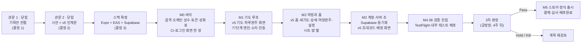

# MyRosary 개발 계획 — 관문 둘이 닫힌 뒤의 정본

> **이 문서는 이 저장소의 개발 계획 정본이다.** 2026-09-05에 컨펌용 기획안으로 썼고, 그 뒤 결정 1·2·3이 나오면서 2026-09-08에 지금 상태로 고쳤다. 무엇이 바뀌었는지는 바로 아래 "무엇이 달라졌나"에 있다. 결정의 정본은 언제나 `decisions.md`이고, 이 문서와 어긋나면 그쪽을 믿는다.

> 한 줄 요지: **관문 둘(기획 컨펌·시안 확정)이 모두 닫혀 지금 열려 있는 것은 구현뿐이다.** 만들 것은 `docs/design/v5/`가 확정한 화면 열이고, 만드는 도구는 결정 3이 정한 Expo + EAS Build + Supabase이며, 길은 마일스톤 여섯(§6-3)이다. 당장 착수할 M0의 작업 지시서는 `docs/plan/m0-work-order.md`에 따로 있다.

작성 2026-09-05 · 개정 2026-09-08 · KimPM · 브랜치 `claude/my-rosary-app-development-pmbcy9`

## 무엇이 달라졌나 — 2026-09-05 판과 지금 판의 차이 셋

이 문서를 처음 썼을 때와 지금 사이에 결정 셋이 났다. 각각이 이 문서의 어디를 무효로 만들었는지 먼저 적어 둔다. 무효가 된 절은 **지우지 않고 표시만** 했다 — 나중에 "그때 무엇을 하려 했는데 왜 안 하게 됐나"를 되짚을 때 필요하기 때문이다.

| 결정 | 무슨 일이 있었나 | 이 문서에서 무엇이 바뀌었나 |
|---|---|---|
| **결정 1** (2026-09-05) | 관문 1이 닫혔다. 화면 세 곳을 프로토타입 방식으로 가기로 해 **화면이 여덟에서 열로 늘었다** | §13 체크리스트의 3·4·5번이 답을 받았다. §8 과제 목록에 D-N·D-O가 더해졌다 |
| **결정 2** (2026-09-08) | 시안 정본이 **atelier v5 인계본**(`docs/design/v5/`)으로 바뀌었다. 그리면서 확정할 시안이 남지 않아 **관문 2가 수행이 아니라 대체로 닫혔다** | §6-2(관문 2)와 §8(디자인 과제 D-A~D-O 전부)이 **수행 대상에서 빠졌다.** 두 절 머리에 그 사실을 적었다. §6-3의 M1·M2는 "화면을 만든다"에서 "**v5의 화면을 옮긴다**"로 성격이 바뀌었다 |
| **결정 3** (2026-09-08) | 프레임워크·스택이 **A안(Expo + EAS Build + Supabase)**으로 확정됐다 | §7 결정 카드가 **닫혔다.** M1 이후로 들어가지 못하게 걸어 둔 빗장이 풀렸다 |

---

---

## 1. 무엇을 확인했나 — atelier 정본을 읽은 결과

공방장 지시("개발을 하기 전에 Atelier 레포에서 PRD 및 관련 문서를 확인해봐")대로 아래를 전문 읽었다.

| 읽은 것 | 어디 | 무엇을 얻었나 |
|---|---|---|
| PRD 제3판 `06-prd.md` (586행) | atelier `idea/mobile-rosary/`, 커밋 `f39019b` | 정정 아홉, 뼈대 여섯, 차별점 여덟, FR-01~45(FR-08·09 결번, FR-29 폐기), 화면 여덟 + 시트 일곱, 비기능(§6), 저장(§7), 예외(§8), 범위 밖(§9), 미확정(§11) |
| 디자인 시스템 `06-design-system.md` | 같은 폴더 | 색 토큰 두 벌(밤 기본 잠정·낮), 전례색 슬롯, 서체 계단, 시그니처(실제 묵주 형태 + 숨 쉬는 알), 접근성, 수용 기준 24항목 |
| 화면 명세 `06-screen-spec.md` | 같은 폴더 | 화면마다 요소·상태·확정 문구, **비화면 채널 상수**(받는 사이 공식, 진동 사전, 음성 속도) |
| 화면 지도 `06-screen-map.md` | 같은 폴더 | 시나리오 17개 검증, 결함 8~12와 처방(이미 PRD에 반영), "화면 목록은 닫혔다" 게이트 |
| 서비스 설계 `06-service-design.md` | 같은 폴더 | 유저 스토리 US-01~11, 정보 구조(탭 바 없음), 백 오피스 없음 |
| 안건 메타 `_meta.md` | 같은 폴더 | 현재 단계 = 묶음 4 진행 중(06 제3판 완료, 07 시안 판정 대기, 08 검증 대기). **다음은 08 검증 — 공방장 며칠 실사용 → iOS로 신자 10명 이내 4주 → 지표(완주 50%·구매 20%) → 3차 판정** |
| atelier `decisions.md` (720행 중 이 안건 관련 항목) | atelier 루트 | 2026-08-26 첫 실사이클 안건 = MyRosary, **D6 "어디서 개발하나" 세 갈래**, 2026-08-28 DQ-01·02·04·05 판정, 2026-09-05 정정 아홉과 강등된 결정 큐 |
| atelier `.claude/retired.json` | atelier | progress-dashboard 폐기 경위 — 이 저장소에도 같은 도구가 내려와 있어 폐기 여부를 판단할 근거 |
| 프로토타입 핸드오프 `README.md` · `screens-day.html` · `assets/` | 공방장 zip | 한지 낮 벌 화면 열 벌의 상세 명세, 디자인 토큰, 상태 모델, "확정이 필요한 것 6개" |
| 프로토타입 v4 `07-prototype/v4/index.html` | atelier | 기도문·신비 제목 상수와 77단계 생성 로직 — `spec/`의 출처 |
| 이 저장소의 `.github/workflows/*.yml`, `.claude/settings.json`, 훅, 검사 스크립트 | My-Rosary-App | 앱 코드가 들어올 때 걸릴 검사(§11 참고) |

**이미 정해져 있어 다시 묻지 않는 것.** 공방장 정정 아홉(홈 = 여정 목록, 계정 필수, 낭송 셋, 조 기도, 묵주 고르기, 판본 선택, 손 없이 조작 선택, 한복 성모 삭제, 54일 진척 필수)과 06-e 결함 8~12의 처방은 PRD 제3판에 이미 반영돼 있다. DQ-01(V1 = 교대 낭송·침묵 진행·끊기면 이어 줌), DQ-02(음성 인식 없음), DQ-04(접는 지표 완주 50%·구매 20%), DQ-05(중심 질문 "화면을 보지 않고 손을 쓰지 않고도 5단을 끝까지")도 확정이다.

**아직 열려 있던 것 셋.** (1) D6 — 어디서 개발하나: 이번 요청이 ②(이 저장소)로 답했다(`decisions.md` 결정 0). (2) 프레임워크·스택: atelier는 정하지 않았다 — 이 문서 §7의 카드. (3) 프로토타입 README의 "확정이 필요한 것 6개"와 PRD §11의 미확정 — `decisions.md` 결정 큐로 옮겼다.

---

## 2. PRD와 요청 사이에서 이번에 새로 정해진 것 — 결정 0

| # | 정해진 것 | 대가 |
|---|---|---|
| 0-1 | 이 저장소에서 바로 개발한다 (atelier D6의 ②) | Foundry 절차는 다음 안건부터 |
| 0-2 | 제품 정본을 `docs/product/`로 이관, atelier는 freeze | PRD 정정은 여기서만 |
| 0-3 | **Android를 V1에 넣는다 — PRD §6·§9 개정** | 심사 두 곳 · 테스트 기기 두 벌 · 음량 버튼의 플랫폼 차이(Q-06a) |
| 0-4 | 관문 둘(기획 컨펌 → 디자인 컨펌) 뒤에 개발 | 이번 턴은 코드 없이 기획안까지 |

상세는 `decisions.md` 결정 0. PRD 본문의 §6·§9 개정은 관문 1 컨펌 뒤 한 번에 반영한다.

---

## 3. 정합 확인표 — 프로토타입이 그린 것 vs PRD가 정한 것

프로토타입 README를 그대로 믿지 않고 PRD 정본과 대조했다. **판정 기준: 화면 목록은 06-e §5 게이트로 닫혔고, 고르는 조작은 기도 화면 밖(설정·새 기도)에만 둔다는 PRD §3-5가 우선한다.** 프로토타입이 더 나은 근거를 댄 곳(대비·터치 영역)은 프로토타입을 따르고 PRD를 갱신한다.

| # | 자리 | 프로토타입이 그린 것 | PRD가 정한 것 | 판정 |
|---|---|---|---|---|
| 1 | 플랫폼 | (언급 없음) | §6 "V1은 iOS, Android는 V1.5" | **공방장 지시로 개정** — 양 플랫폼 V1 (결정 0-3) |
| 2 | N 새 기도 — 구조 | 구역 넷: ①지향 ②청원/감사 ③낭송 방식 인라인 ④묵주 고르기 | FR-33 세 걸음: 1/3 바람(24자) · 2/3 형식(54일·9일·날마다) + 혼자/함께 · 3/3 시작일 + 판본(S4) + **완료 예정일 자동 계산** + 첫날 신비 미리보기 | **절충 (결정 1-2)** — 프로토타입의 네 구역 구조를 쓰되, PRD가 요구하는 것 중 프로토타입에 없던 것(형식 선택 54일·9일·날마다, 혼자/함께, 시작일, 판본, 완료 예정일 자동 계산, 첫날 신비 미리보기)을 그 안에 채운다 (관문 2 과제) |
| 3 | N — 청원/감사 | 사용자가 고른다. "감사 = 쉰네 날 내내" | 고르지 않는다. 54일의 1~27일 청원, 28~54일 감사로 **자동**(FR-35). "쉰네 날 내내 감사"는 PRD에 없다 | **PRD 따름** — 선택 칸 삭제 |
| 4 | N — 낭송 방식 인라인 | "차별점 #2이므로 인라인 노출, 시트로 숨기지 말 것" | §3-5 2항·06-b §9 23번: 고르는 일은 설정에서만. 차별점 2는 "첫 성모송에서 겪게 한다" | **프로토타입 따름 (결정 1-2)** — N에서 인라인으로 고른다 |
| 5 | N — 묵주 고르기 | N 안에 `묵주 · 나무 · 고르기 →` 한 줄 | FR-39: 설정의 S5 시트. 모든 여정에 적용 | **PRD 따름** — N에서 빼고 설정으로 |
| 6 | 홈 → 기도 진입 | 카드 전체 탭만 | FR-42 카드 탭 = 기도 + 카드의 "자세히" → 여정 상세 D (FR-37) | **PRD 따름** — "자세히" 진입점 추가 |
| 7 | 홈 — 기타 요소 | 여정 블록 둘, 새 기도, 초대 코드 | + 시작 전 카드(흐림), 마친 카드(아래), 연결 없음 한 줄, 음성 없음 안내, 설정 우상단, 소개 (i) → S7, 빈 홈 문구 두 줄 | **PRD 따름** — 상태·요소 보완 (관문 2) |
| 8 | 초대 코드 입력 | 별도 화면 "2. 초대 코드 입력"(여섯 칸 + 여정 미리보기 카드) | 06-e 결함 12 처방: 홈의 **요소 하나**(코드 입력). 새 화면이 아니다 | **프로토타입 따름 (결정 1-1)** — 별도 화면 `I 초대 코드 입력`으로 만든다 |
| 9 | L 로그인 — 초대 코드 진입 | 로그인 화면에 `초대 코드로 들어가기` | 계정 필수(FR-32). 코드 입력은 홈에서(FR-40) — 로그인 전 합류는 성립하지 않는다 | **PRD 따름** — L에서 삭제 |
| 10 | "함께 바치기 배정" 화면 + "다섯 단 모두 혼자 바치기" | 새 화면과 단추 | 화면 목록 밖. 조 배정은 홈 카드 넷째 줄과 D의 조 영역(FR-40). "혼자 다 바침"은 §9가 V1.5로 미룬 다른 조 방식 | **프로토타입 따름 (결정 1-3)** — 별도 화면 `G 함께 바치기 배정`을 만들고 단추도 둔다 |
| 11 | B 기도 — 읽지 않기 진행 | "소리 없이면 탭으로 진행" | FR-13·14: 읽지 않기도 **진동 + 받는 사이로 자동 진행**. 탭 진행은 없다 | **PRD 따름** |
| 12 | B — 누락 요소 | 없음 | 멈춤 상태(이어서 바치기/홈으로) · 5단 막대(조 기도면 내 단만 강조) · 알 속 숫자 `N / 10` · 알의 다섯 상태(FR-15) | **PRD 따름** — 시안 보완 (관문 2) |
| 13 | B — 비화면 채널 상수 | 4초 호흡만 | 06-d 화면 B §7-3: 받는 사이 `(900ms + L × 132ms) ÷ 0.75/1/1.35`, 진동 사전 18 / 28-60-28-60-28 / 20-50-20 / 200, 음성 속도 0.92, 신비 선포 2200ms | **PRD 따름** — `spec/journey-rules.md`에 옮겨 적음 |
| 14 | E 설정 — 항목 | 기도문 판본 · 낭송 기본값 · 소리 속도 · 낮과 밤 · **글자 크기** · **기도 시각 알림** · 로그아웃 | 낭송 방식 셋 · 받는 사이(S2) · **손 없이 조작 켬/끔**(FR-38) · **묵주 고르기**(S5) · 기본 판본(S4) · 밤/낮 · 계정 정보와 연결 상태(FR-41) · 로그아웃 · **계정 삭제**(FR-45, 심사 필수) · 소개 (i). 글자 크기는 시스템을 따르고(FR-28) 알림은 §9 미정 | **PRD 따름** — 계정 삭제·손 없이·묵주·받는 사이·계정 정보·소개 추가, 글자 크기·알림 삭제 |
| 15 | D 여정 상세 | 격자 · 통계 · 이어서 바치기 · "이 여정 그만두기" 하나 | + **오늘 처음부터**(FR-18, S3 확인) · 조 영역(초대 코드 나누기 · 조원 N/5 · 오늘 배정) · 삭제 문구 셋으로 갈림 — 혼자 지우기 / 만든 사람 조 해산 / 조원 나가기 (S6, 06-e 결함 9) | **PRD 따름** — 요소 보완, 문구 분기 (관문 2) |
| 16 | 시트 | 그리지 않음 (묵주 고르기만 "별도 시트"로 언급) | S2 받는 사이 · S3 오늘 처음부터 · S4 판본 · S5 묵주 · S6 삭제/해산/나가기 · S7 소개 · 계정 삭제 확인 — 일곱 | **PRD 따름** — 시트 일곱 시안 필요 (관문 2). 수는 Q-01 |
| 17 | 디자인 벌 | 낮(한지) 한 벌 | 06-b §2-2: 밤(쪽빛 `#10161F`, 기본값 잠정)과 낮 **두 벌을 동등 품질로**, 기본값은 08 검증에서 | **PRD 따름** — 밤 벌 시안은 관문 2 과제, 기본값은 D-2 |
| 18 | 치자-d 강조색 | `#82600F` (본문 대비 4.7:1을 위해 조정) | 06-b `#8A6516` (본문에 그대로 쓰면 3.9:1로 떨어짐 — 프로토타입 README가 실측) | **프로토타입 따름, 06-b 갱신** (Q-09) |
| 19 | 터치 영역 | 80px 실측, 88px 권고 | §6·06-b §7 "최소 80픽셀" | **프로토타입 따름 88px, PRD 갱신** (Q-06b) |
| 20 | 묵주 그림 | 현재 단 10알 + 큰 알만 실제 크기, 나머지 고리는 실선으로 암시 (59알을 8%로 다 그릴 수 없음). "제품팀 확인 필요" | FR-21 실제 묵주 형태 · FR-26 현재 알 8% 이상 · FR-15 다섯 상태. 나머지 알의 표현은 PRD가 정하지 않았다 | **관문 2에서 판정** — KimDesigner가 대안 둘 이상을 시안으로 내고 공방장이 고른다 |
| 21 | 성화 | 화면당 고정 도판 1장(4장 자산) | FR-22 **신비가 바뀌면 배경 성화가 바뀐다** · FR-23 이목구비 가림 금지 · D-1 출처 미정 | **PRD 따름** — 신비 4종별 교체 슬롯. 자산은 D-1 |
| 22 | 폰트 | Google Fonts CDN | 번들 폰트 (README도 같은 말) | **번들** — Noto Serif KR·Noto Sans KR은 OFL 라이선스라 번들 가능 |
| 23 | 조 진척 · 조 오프라인 첫날 · 로그아웃 손실 | 임시 문안으로 대응 | PRD 공백 (README도 인정) | **결정 큐 기본값** Q-03 · Q-04 · Q-05 |

**함께 확인한 것 — 프로토타입 README의 실측 교훈은 그대로 살린다.** 등호장(equal arc length) 알 배치, SVG 호흡에 `transform-box:fill-box`, 기도문 영역 고정 높이 + `overflow:hidden`, 하단 조작에 `flex:none; min-height`. 이것들은 PRD와 충돌하지 않고 구현 시 그대로 지킬 규칙이다.

---

## 4. 목표와 성공 기준 — 다음 목표는 출시가 아니라 08 검증 진입이다

atelier `_meta.md`와 로드맵이 정한 임계 경로는 코드가 아니라 **사람이 써 보는 4주**다. 화면 명세 E도 "V1은 무료 검증 단계"라고 적었다. 그래서 목표를 둘로 가른다.

| 목표 | 성공 기준 | 언제 |
|---|---|---|
| **목표 1 — 08 검증 진입** | 공방장 폰(iOS)에 TestFlight로, Android 검증자 폰에 Google Play 내부 테스트로 설치된 앱이 있고, **혼자 54일 여정을 만들어 첫날 77단계를 손 없이 완주**할 수 있으며(중심 질문 DQ-05), 계정 로그인·기기 간 이어가기·조 기도가 동작한다. 검증 참가자 10명 이내가 4주 쓴다 | M4 끝 |
| **3차 판정 (사람)** | 지표 두 줄 — 완주율 50% · 구매 의향 20%(DQ-04). Pass / Hold / Kill | 4주 뒤 |
| **목표 2 — 스토어 정식 출시** | App Store와 Google Play 심사를 통과해 **검색해서 설치할 수 있는** 상태(배포완료). 결제(창립 멤버 평생권)가 여기서 들어간다 | M5 끝 |

"완료"라는 말은 배포완료(main 머지 + 실환경 노출 확인)에만 쓴다(communication 규칙 7).

---

## 5. 범위 — V1(검증 빌드)에 넣는 것과 넣지 않는 것

**넣는 것**: PRD §4 FR-01~45 전부(FR-08·09 결번, FR-29 폐기 제외). 화면 열(L·A·N·B·C·C′·D·E·I·G) + 시트 일곱. 밤·낮 두 벌. 양 플랫폼.

**넣지 않는 것 (PRD §9 그대로 + 이 계획이 더한 것)**:

| 무엇 | 왜 | 언제 |
|---|---|---|
| 결제(창립 멤버 평생권 → 평생 결제 → 본당 라이선스) | 검증 단계는 무료. 05단계 값 모델은 정식 출시 항목 | M5 |
| 음량 버튼 조작(Android 포함) | iOS 심사 2.5.9. Android는 검증 뒤 판단 (Q-06a) | 3차 판정 뒤 |
| 알림·푸시 | §9 — 필요한지부터 08에서 검증 | 미정 |
| 목소리 고르기 · 다국어 · 가족/본당 계정 · 조의 다른 방식 | §9 V1.5~V2 | — |
| 완주 공유 카드 · 배지 · 순위 · 광고 · 배속·건너뛰기 · 음성 인식 | §9 "만들지 않는다" | 영구 |
| 백 오피스(관리자 화면) | 06-c §3 — V1에 없다. 조·계정은 데이터베이스 콘솔로 본다 | — |

---

## 6. 진행 순서 — 관문 둘은 닫혔고, 남은 것은 마일스톤 여섯이다

### 6-1. 관문 1 — 기획안 컨펌 · **닫힘 (2026-09-05, 결정 1)**

§13 체크리스트의 다섯 항목이 모두 답을 받았다. 화면이 여덟에서 열로 늘어난 것이 이 관문의 가장 큰 산출이다. PRD §6·§9·터치 영역·치자-d 개정은 아직 `docs/product/06-prd.md`에 반영하지 않았고, M0와 병행해 한 번에 반영한다.

### 6-2. 관문 2 — KimDesigner 시안 확정·보완 · **닫힘 (2026-09-08, 결정 2) — 수행하지 않는다**

> **이 절은 더 이상 할 일이 아니다.** 결정 2로 **시안 정본이 atelier v5 인계본(`docs/design/v5/`)으로 바뀌면서 새로 그릴 시안이 없어졌다.** 관문 2는 "통과"가 아니라 "대체"로 닫혔다. 아래 원래 계획은 기록으로 남긴다.

원래 계획은 이랬다 — KimDesigner가 프로토타입 "한지 낮" 벌을 출발점으로 §8의 과제를 수행해 화면 열과 시트 일곱을 두 벌(밤·낮)로 확정하고, 공방장이 컨펌하면 개발이 시작된다.

**대신 지금 성립하는 것은 이렇다.** 화면 열의 모양·문구·값은 v5가 확정했으므로 KimDesigner의 일은 "그리기"에서 **"구현된 화면을 v5와 대조해 검수하기"**로 바뀐다. 각 마일스톤 끝에 렌더된 화면을 눈으로 보는 시각 반복 루프가 그 자리를 대신한다.

**v5가 덮지 못한 두 가지는 남는다** — 바텀 시트 일곱(S2~S7과 계정 삭제 확인)과 밤 벌(쪽빛 테마)이다. v5에는 낮 벌 화면 열만 있다. 이 둘은 시안을 새로 그리지 않고 **v5가 확립한 값 체계에서 구현자가 파생해 코드로 먼저 만들고 KimDesigner가 렌더를 검수하는 방식**으로 간다(`decisions.md` Q-14). 필요해지는 시점은 M2다.

### 6-3. 마일스톤 M0~M5 — 산출물과 노출 증명

각 마일스톤은 communication 규칙 7-3에 따라 "무엇으로 닿았음을 증명하나"를 함께 적는다. **실기기 확인은 공방장 몫**이고(이 클라우드 컨테이너에는 기기도 맥도 없다), Claude가 스스로 할 수 있는 검증은 웹 빌드의 Playwright e2e와 클라우드 빌드 성공 로그까지다.

**M1·M2의 성격이 바뀌었다는 점을 먼저 못 박는다.** 결정 2 이전의 M1·M2는 "화면을 설계해 만든다"였다. 지금은 **"v5가 확정한 화면을 React Native로 옮긴다"**이다. 만드는 일이 아니라 옮기는 일이므로, 구현자가 화면의 값을 새로 정하는 일은 없어야 한다. 값이 어디에 있는지는 아래 표에 마일스톤마다 적었다.

**v5의 값이 어디에 있나 — 옮기는 사람이 헷갈리지 않도록 한 번에 적는다.**

| 찾는 것 | 어디에 있나 | 어떻게 생겼나 |
|---|---|---|
| 화면의 색·글자 크기·간격·문구 | `docs/design/v5/index.html`의 **각 화면 마크업 안 인라인 스타일** | 스타일시트에 한 줄도 없다. 화면 하나를 옮길 때 그 화면의 `
` 블록만 보면 값이 전부 나온다. 예: 로그인의 주 단추는 `height:80px; background:#1F2530; font:500 15px/1 'Noto Sans KR'` |
| 화면 열의 식별자 | 같은 파일의 `id="s-..."` | `s-login` · `s-invite` · `s-home` · `s-new` · `s-assign` · `s-pray` · `s-dayDone` · `s-journey` · `s-allDone` · `s-settings` |
| 성화 슬롯 표 | 같은 파일 `ART` 배열 (약 343행부터) | 그림 16장 각각이 네 슬롯(`login` · `thumb` · `prayer` · `finish`)의 초점 좌표를 갖고, 쓸 수 없는 슬롯은 `no` 목록에 적혀 있다 |
| 성화 파일 | `docs/design/v5/art/` (16장) | 파일 이름이 `ART` 배열의 `f` 값과 같다 |
| 성화 뽑기 규칙 | 같은 파일의 `pool` · `take()` · `JOURNEY_SLOTS` | 세션 안에서 고정, 비복원 추출, 여정용 그림은 세 슬롯을 모두 통과해야 한다 |
| 기도 도메인의 사실 | `spec/` (v5가 아니다) | 77단계·신비·54일 규칙·받는 사이 공식. 화면의 값은 v5가, 기도의 규칙은 `spec/`이 정본이다 |

| 마일스톤 | 만드는 것 | 노출 증명 (작업완료 조건) | 사람 몫 |
|---|---|---|---|
| **M0 바닥** — 지시서 `docs/plan/m0-work-order.md` | Expo + TypeScript 골격(루트에 앉힘, Q-15), `spec/` JSON을 **import 해 쓰는** 도메인 상수와 단위 테스트(77단계·54일 순환·요일 규칙·받는 사이 공식), v5 낮 벌 **디자인 토큰**, v5 `ART` 배열을 옮긴 **성화 슬롯 표와 뽑기 함수**, 성화 16장을 `assets/art/`로, CI 검사 하나, `app.json`·`eas.json`, **화면은 로그인 한 장만** | (1) 타입 검사 통과, (2) 단위 테스트 통과, (3) `expo export --platform web` **웹 빌드 성공**, (4) 그 빌드를 띄워 **로그인 화면 스크린샷 1장**, (5) 콘솔 오류 0건. **iOS·Android 네이티브 빌드는 이 환경에서 불가능하므로 M0의 조건이 아니다** — 설정만 갖추고 "계정 연결 뒤 실행"으로 남긴다 | **Expo 계정**, **Apple Developer Program**($99/년), **Google Play Console**($25 1회) — 지시서 끝의 부탁 셋 |
| **M1 기도 루프** | v5 `s-pray`(기도)와 `s-dayDone`(하루 완주) 두 화면을 값 그대로 옮긴다. 그 위에 77단계 엔진(`spec/prayer-sequence.json`), 낭송 셋과 한국어 음성, 받는 사이 공식, 진동 사전, 흔들기·이어폰 버튼, 화면 켜짐 유지, 알마다 로컬 자리 저장과 이어가기, 전례색 슬롯(Q-10) | (1) 웹 빌드에서 **Playwright e2e가 77단계 자동 완주**(소리·진동은 호출 여부만 검증), (2) 공방장이 실기기에서 하루 다섯 단을 바친 뒤 "손 없이 끝까지 갔나" 한 줄 회신, (3) "보는 법" 세 줄 | 실기기 실사용 1회 |
| **M2 여정과 홈** | v5 `s-home`·`s-new`·`s-journey`·`s-allDone`·`s-settings` 다섯 화면을 값 그대로 옮긴다. 로컬 저장(여정·기록·설정), 여정 형식 셋(`spec/journey-rules.md` §1). **v5에 없는 둘을 여기서 파생한다** — 바텀 시트 일곱과 밤 벌(Q-14) | (1) Playwright e2e — 새 기도에서 첫날 완주, 홈 카드 갱신, 상세 격자, 날짜를 돌려 54일째 여정 완주까지, (2) KimQA `qa-swarm` 1회(웹 빌드), (3) KimDesigner가 렌더 화면을 v5와 대조 검수, (4) 여기서부터 공방장의 개인 4주 실사용을 미리 시작할 수 있다 | 실사용 · 시트와 밤 벌 검수 |
| **M3 계정·서버·조** | Supabase 프로젝트, 구글·애플 로그인(M0의 로그인 화면에 실제 인증을 붙인다), 스키마와 RLS, 바람 문구 암호화, 로컬 우선 동기화(앞선 자리 우선), 서버 함수(초대 코드 발급·검증, 날마다 배정, 나가기 재배정). v5 `s-invite`(초대 코드 입력)와 `s-assign`(함께 바치기 배정) 두 화면을 여기서 옮긴다 — 조 기능이 있어야 의미가 있기 때문이다. 계정 삭제, 로그아웃(Q-05) | (1) 두 기기(또는 두 세션) 동기화 e2e, (2) 조 다섯 명 시뮬 e2e(배정과 "다섯 중 K"), (3) 마이그레이션 로컬 적용 로그와 **실환경 적용 꼬리표**, (4) 공방장 폰에서 로그인한 뒤 다른 기기에서 이어가기 확인 | 라이브 DB 쓰기 승인(열쇠), 구글 OAuth·애플 Sign in 콘솔 설정 |
| **M4 08 검증 진입** | 검증 빌드(S7 소개 시트 포함), TestFlight **외부 테스트**(신자 10명 이내)와 Google Play **내부 테스트** 트랙, 참가자 안내문, 지표 수집 방식(PRD §7), D-4 공식 기도문 전문 입력 | (1) 참가자 폰에 설치되고 첫날 완주 보고, (2) 4주 뒤 지표 두 줄 | 참가자 모집, 기도문 사용 권한 확인(D-4), 사제 자문 |
| **3차 판정** | — | 완주 50% · 구매 20% | **공방장 판정** Pass / Hold / Kill |
| **M5 스토어 정식 출시** | 결제(창립 멤버 평생권 — 인앱 결제 두 스토어), 정식 성화 자산(D-1 카드), 개인정보 처리방침 URL, 스토어 메타(아이콘·스크린샷·설명·개인정보 라벨·데이터 안전), 심사 메모, 음량 버튼(Android, Q-06a 판단 시) | 심사 통과 뒤 **검색해서 설치되는 것 확인** = 배포완료 | 심사 제출 승인, 결제 상품 등록, 성화·기도문 권리 |

**화면 열이 어느 마일스톤에 흩어지나.** 로그인은 M0에서 한 장(바닥이 선다는 증명용), 기도와 하루 완주는 M1, 홈·새 기도·여정 상세·여정 완주·설정 다섯은 M2, 초대 코드 입력과 함께 바치기 배정 둘은 M3다. 합이 열이다.

**일정 감각.** 만드는 노력은 AI가 흡수하므로 병목은 사람 몫이다 — 스토어 계정 개설(승인에 며칠), 실기기 확인 회신, 4주 실사용, 권리 확인. M0~M3 코드는 수 주 안이 현실적이고, 정확한 날짜는 M0가 끝나 실제 속도를 한 번 재고 나서 잡는다.

---

## 7. 결정 카드 — 프레임워크·핵심 스택 · **닫힘 (2026-09-08, 결정 3)**

> **답이 왔다. 택한 것은 A안 — Expo(React Native, TypeScript) + EAS Build + Supabase다.** 공방장 발화 "kimpm A안으로 가고 완료까지 진행해줘"(2026-09-08). 포기한 안 셋(B Flutter · C 네이티브 둘 · D Capacitor)과 각각을 접은 이유, 함께 감수하기로 한 대가 둘은 `decisions.md` 결정 3에 적었다. 이 카드가 걸어 두었던 "M1 이후로 들어가지 않는다"는 빗장은 풀렸다.

아래는 답을 받기 전 상신한 카드 원문이다. 옵션 비교와 전문 검증 근거가 필요할 때 읽는다.

## 결정 요청 — 한 코드로 iOS·Android를 함께 만들 것인가, 그리고 어느 도구로 클라우드에서 iOS를 빌드할 것인가
- **트리거**: §2의 3번, 되돌리기 어려운 구조 선택 (프레임워크·핵심 라이브러리·데이터 모델 방향)
- **무엇이 걸려 있나**: 이 선택이 앞으로 모든 화면과 기능이 놓이는 바닥이 된다. 한 번 고르면 코드를 다시 쓰지 않고는 바꾸기 어렵다. 결정 0-3으로 양 플랫폼이 V1이 됐으니 **한 코드베이스로 둘을 만들 수 있는가**가 비용을 절반으로 가른다. 또 개발 환경이 클라우드 리눅스라 맥이 없으므로 **iOS 빌드와 심사 제출을 클라우드에서 할 수 있어야** 하고, 그 서비스에는 월 비용이 붙을 수 있다. 잘못 고르면 M1에서 소리·진동·이어폰 버튼 같은 기기 기능을 붙이다 막히거나, 팀이 이미 가진 검증 도구(Playwright·qa-swarm)를 못 쓴다.
- **결정 질문**: "팀의 기존 자산(JS/TS·Playwright·Supabase)을 그대로 살리는 A안으로, 소액의 클라우드 빌드 비용 가능성과 이어폰 버튼 구현의 추가 공수를 감수하고 갈 것인가?"
- **옵션 비교**:

  | 옵션 | 비용 (돈·공수) | 시간 | 위험 | 되돌리기 |
  |---|---|---|---|---|
  | **A. Expo(React Native, TypeScript) + EAS Build + Supabase** | 돈: 클라우드 빌드 무료 구간(월 30회) 초과 시 월 약 $19. 공수: **한 코드베이스**, 팀 JS/TS·Supabase 자산 그대로, 웹 빌드로 Playwright·qa-swarm 사용 가능 | 가장 빠름 — M0에서 빈 앱 양쪽 빌드 1주 안 | 이어폰 버튼은 "재생 중" 세션이 있어야 받으므로 오디오 라이브러리 하나가 더 든다. 기기 기능(TTS·햅틱·센서·화면 켜짐·애플 로그인·폰트·SVG 애니메이션)은 공식 모듈이 있다. 웹 빌드에서는 소리·진동을 검증 못 함(실기기 몫) | 어렵다 — 다만 `spec/` 도메인 데이터와 Supabase 스키마는 어느 안으로 가도 재사용 |
  | B. Flutter + Codemagic + Supabase | 돈: 클라우드 빌드 무료 구간(월 500분) 초과 시 종량. 공수: 새 언어(Dart), 팀 자산 재사용 낮음 | 학습 1~2주 추가 | 웹 빌드가 캔버스 렌더라 **Playwright·qa-swarm으로 화면을 검사할 수 없다**. 기기 기능 패키지는 충분 | 어렵다 |
  | C. 네이티브 둘 (SwiftUI + Kotlin) | 돈: 도구는 무료지만 iOS 빌드에 맥 러너 필요(분당 과금 높음). 공수: **코드 두 벌**, 1인 팀에 과함 | 가장 김 | 두 앱이 갈라진다. 클라우드 리눅스에서 iOS 개발 자체가 불가에 가깝다 | 가장 어렵다 |
  | D. Capacitor(웹 앱을 네이티브 껍데기에 넣음) + Supabase | 돈: 무료. 공수: 프로토타입 HTML 재사용 최고, Playwright 그대로 | 첫 화면은 가장 빠름 | 웹뷰에서 **한국어 TTS·이어폰 버튼·백그라운드 소리가 불안정**하고, 애플이 "웹사이트를 감싼 앱"(지침 4.2)으로 볼 위험. 햅틱·센서는 플러그인 의존 | 웹 코드는 살지만 껍데기를 바꾸면 기기 기능을 다시 만든다 |

- **추천**: **A안.** 사유 — 이 앱의 절반은 소리와 진동(PRD §4-6)인데 그 기기 기능을 웹뷰(D)보다 안정적으로 다루면서도, 팀의 검증 자산(Playwright·qa-swarm)을 웹 빌드로 계속 쓸 수 있는 유일한 안이다. · **전문 검증**: 필요한 기기 기능 여덟(한국어 TTS·햅틱·흔들기 센서·이어폰 리모트·화면 켜짐·애플/구글 로그인·폰트 번들·SVG 호흡 애니메이션) 각각에 Expo 공식 모듈 또는 널리 쓰이는 라이브러리가 있고, 리눅스에서 명령 한 줄로 iOS 빌드·스토어 제출을 클라우드 맥에 맡길 수 있음을 KimPM이 지식으로 확인했다. **실제 빌드로 다시 확인하는 것이 M0의 첫 일**이며, M0는 하루 안에 되돌릴 수 있다.
- **무응답 시 기본 행동**: 관문 2(디자인 컨펌)가 끝나는 시점까지 답이 없으면 A안으로 M0에 착수한다. M1부터는 확정 없이 들어가지 않는다. 디자인 작업은 이 결정과 무관하므로 멈추지 않는다.
- **시각 자료**: 변화 보고가 아니라 선택이므로 위 옵션 비교 표로 갈음한다.
- **용어 각주**: **Expo / React Native** — 자바스크립트로 iOS·Android 앱을 한 코드로 만드는 도구. **EAS Build** — Expo가 제공하는 클라우드 빌드 서비스로, 맥이 없는 컴퓨터에서도 iOS 앱을 만들고 스토어에 올릴 수 있다. **Supabase** — 계정 로그인과 데이터베이스, 서버 함수를 제공하는 서비스. 팀 규칙(db-write-permission)이 이미 이것을 전제한다. **TTS** — 글을 소리로 읽어 주는 기기 기능. **햅틱** — 진동. **웹뷰** — 앱 안에 웹페이지를 띄우는 창. **Playwright / qa-swarm** — 팀이 가진 웹 화면 자동 검사 도구. **TestFlight** — 애플의 출시 전 테스트 배포 통로.

**백엔드·인증 경로 (A안에 포함).** Supabase Auth의 구글·애플 제공자(Android에서 애플 로그인은 웹 방식), Postgres에 여정·기록·자리·조 테이블 + RLS(각 행에 누가 접근할 수 있는지를 데이터베이스가 직접 통제), 바람 문구는 앱에서 암호화해 저장(서버는 암호문만 봄), 서버 함수(Edge Functions)로 초대 코드 발급·검증과 날마다 배정. 마이그레이션 파일명은 팀 규칙(시각 형식). 라이브 DB 쓰기는 훅이 막고 사용자가 열쇠를 연다. `.mcp.json`은 Supabase 프로젝트가 생기면 이 저장소에 만든다.

---

## 8. KimDesigner에게 넘길 디자인 과제 · **닫힘 (2026-09-08, 결정 2) — 수행하지 않는다**

> **이 목록(D-A~D-O)은 더 이상 할 일이 아니다.** 결정 2로 **시안은 v5 인계본(`docs/design/v5/`)이 정본**이 되어, 여기 적힌 과제 대부분을 v5가 이미 담고 있거나 대체했다. 이 절을 지우지 않고 남기는 이유는 두 가지다. 첫째, v5가 **덮지 못한 항목**을 나중에 되짚을 수 있어야 한다 — 확인해 보니 **D-A(밤 벌)와 D-I(시트 일곱)** 둘이 v5에 없다. 이 둘의 처리는 `decisions.md` Q-14가 정했고(구현자가 v5 값에서 파생, KimDesigner가 렌더 검수), 필요해지는 시점은 M2다. 둘째, 각 과제가 인용한 FR 번호가 구현할 때 근거로 쓰인다.

아래는 관문 2를 수행할 계획이었을 때 쓴 과제 목록 원문이다.

출발점은 프로토타입 "한지 낮" 벌이다. **지킬 것**: 디자인 토큰·서체 계단·라디우스 0·그림자 0·괘선 구조·축하 어휘 금지·붉은 경고색 금지. **바꿀 것**은 아래다.

| # | 과제 | 근거 | 산출물 |
|---|---|---|---|
| D-A | **밤 벌** — 쪽빛 `#10161F` 바탕의 두 번째 벌을 낮 벌과 동등 품질로 | 06-b §2-2, D-2 | 화면 열 + 시트 일곱 밤 벌 |
| D-B | **N 새 기도 — 프로토타입의 네 구역 구조를 지키며 빠진 것을 채움**(결정 1-2). ① 지향 한 줄(24자) ② 청원/감사 ③ 낭송 세 줄(인라인 유지) ④ 묵주 한 줄. 여기에 PRD가 요구하는 형식 선택(54일·9일·날마다) · 혼자/함께 · 시작일 · 판본 · **완료 예정일 자동 계산** · 첫날 신비 미리보기를 같은 화면 안에 배치한다. 길어지면 구역 목록만 스크롤하고 하단 `시작하기`는 고정 | 결정 1-2, FR-33·35·43 | N 2~3장(상태 포함) |
| D-C | **E 설정 보완** — 계정 삭제(확인 시트) · 손 없이 조작 켬/끔(플랫폼별 설명 한 줄) · 묵주 고르기(S5 진입) · 받는 사이(S2 진입) · 계정 정보와 연결 상태 · 소개 (i). 글자 크기·알림 삭제. 묶음 셋(바치는 방식 / 보이는 것 / 계정)의 위계 | FR-06·07·38·39·41·45, 06-b §9 15번 | E 1장 |
| D-D | **B 기도 보완** — 멈춤 상태(이어서 바치기/홈으로) · 5단 막대(조 기도면 내 단만 강조) · 알 속 `N / 10` · 알의 다섯 상태(읽는 중 테두리 차오름 / 내 차례 호흡 / 진동 진행 반짝 / 단 전환 확장 / 멈춤 흐림) | FR-15·16·18, 06-b §4-2 | B 상태별 5장 |
| D-E | **묵주 그림의 나머지 알** — 현재 단만 실제 크기로 그린 타협에 대해 대안 둘 이상(예: 전체 59알을 작게 + 현재 단 확대 / 현재 단 + 이웃 단 페이드 / 지금 방식 유지) | FR-21·26, §3 #20 | 비교 시안 + 권고 |
| D-F | **묵주 3종** — 나무·진주·유리처럼 서로 확실히 다른 셋, 각각 다섯 상태를 표현 | FR-39, 06-b §9 22번 | S5 시트 + 각 묵주의 B 1장 |
| D-G | **홈 A 보완** — 카드의 "자세히" 진입점, 시작 전 카드(흐림), 마친 카드, 조 카드 넷째 줄, 연결 없음 한 줄, 음성 없음 안내, 설정·소개 (i) 우상단, 빈 홈. 초대 코드 진입점은 홈에만 두고(결정 1-1) L의 진입점은 삭제 — 계정이 필수라 로그인 전 합류는 성립하지 않는다 | FR-36·37·40·42, §3 #6~9 | A 상태별 4~5장 |
| D-H | **D 여정 상세 보완** — 오늘 처음부터(S3), 조 영역(초대 코드 나누기 · 조원 N/5 · 오늘 배정), 삭제 문구 셋 분기(S6). "함께 바치기 배정" 화면은 만든다(결정 1-3) — 아래 D-O | FR-18·40·44, §3 #10·15 | D 2장(혼자/조) |
| D-I | **시트 일곱** — S2 받는 사이 · S3 오늘 처음부터 · S4 판본(성모송 첫 줄 미리보기) · S5 묵주 · S6 삭제/해산/나가기 · S7 소개 · 계정 삭제 확인 | 06-d 시트 표 | 시트 7장 × 두 벌 |
| D-J | **성화 슬롯** — 신비 4종별로 바뀌는 교체 가능 슬롯, 이목구비를 가리지 않는 안전 영역 표시. 자산은 저작권 만료 고전 성화(D-1) | FR-22·23 | 슬롯 규격 + 4종 자리 |
| D-K | **터치 88px · 치자-d `#82600F`** 로 토큰 확정, 06-b §2-2·§7 갱신 문안 | Q-06b·Q-09 | 토큰 표 |
| D-L | **접근성 실측** — 시스템 글자 200%에서 기도문 영역(고정 높이) 안에서 사도신경이 깨지지 않는 처리, 본문 대비 4.5:1 실측표 | FR-28, 06-b §7·§9 16번 | 실측표 |
| D-M | **수용 기준 24항목 자가 점검표**를 시안 README에 첨부 | 06-b §9 | 점검표 |
| D-N | **`I 초대 코드 입력` 화면**(결정 1-1). 프로토타입 화면 2를 그대로 살리되 상태 넷을 그린다 — 빈 칸 / 입력 중 / 여섯 칸 채움 + 여정 미리보기 / 코드 오류(`이 코드의 기도를 찾지 못했습니다`)와 정원 참(`이 기도는 다섯 명이 다 모였습니다`) | 결정 1-1, FR-40, PRD §8 | I 상태별 4장 |
| D-O | **`G 함께 바치기 배정` 화면**(결정 1-3). 프로토타입 화면 5를 살리되 `다섯 단 모두 혼자 바치기`를 누를 때의 확인 문구와, 조 진척 K 표기(Q-03)를 함께 그린다. 오프라인에서 배정을 못 받은 상태(PRD §8 "오늘 배정을 아직 받지 못해…")도 한 장 | 결정 1-3, FR-40·44, Q-03 | G 상태별 3장 |

---

## 9. 검증 배포와 스토어 제출 체크리스트

### 9-1. 사람 몫 — 계정 (M0 전에 시작해야 M4에 맞는다)

부탁 서식(communication 규칙 8-2)으로 적는다. 둘 다 브라우저만으로 되고, 기계로 대신할 수 없는 것(계정·결제)이다.

| 부탁 | 어디서 | 무엇을 | 성공하면 무엇이 보이나 | 안 하면 무엇이 걸리나 |
|---|---|---|---|---|
| Apple Developer Program 등록 | 브라우저 → developer.apple.com → Account → Enroll (개인, 연 $99) | Apple ID로 로그인 → 개인 등록 → 결제. 승인은 보통 하루 안 | Account 화면에 "Membership" 정보가 보인다 | M0의 iOS 빌드 서명과 TestFlight 배포 전부. 승인에 하루 이상 걸릴 수 있어 **가장 먼저** |
| Google Play Console 등록 | 브라우저 → play.google.com/console → 계정 만들기 (개인, 1회 $25) | Google 계정으로 로그인 → 개발자 계정 만들기 → 본인 확인 → 결제 | Console 홈에 "앱 만들기" 단추가 보인다 | M0의 Android 내부 테스트 트랙. **주의**: 2023-11 이후 신규 개인 계정은 정식 출시 전 **테스터 20명 × 14일 비공개 테스트**가 필수 — 08 검증 참가자가 이 요건을 겸할 수 있게 M4에서 계획 |
| 빌드 서비스 계정 (A안이면 Expo 계정) | 브라우저 → expo.dev 가입 | 무료 계정 생성. 저장소 연결은 Claude가 안내 | 대시보드에 프로젝트가 보인다 | M0의 클라우드 빌드 |

### 9-2. 08 검증 배포 (M4)

- iOS: TestFlight 내부 테스트(공방장) → 외부 테스트(참가자 10명 이내, 애플의 간이 심사 통과 필요).
- Android: Google Play 내부 테스트 트랙(참가자 이메일 등록) — 이 기간이 신규 계정의 비공개 테스트 요건을 채운다.
- 검증 빌드에만 S7 소개 시트를 켠다(무엇을 검증하는지 · 아직 아닌 것).
- 지표 수집은 앱이 아니라 **사용자가 직접 알려 주는 방식**(PRD §7). 4주 끝에 설문 두 줄.

### 9-3. 스토어 정식 제출 (M5)

| 항목 | App Store | Google Play |
|---|---|---|
| 앱 아이콘 | 1024×1024 | 512×512 + 기능 그래픽 1024×500 |
| 스크린샷 | 필수 기기 크기별(6.9"·6.5" 계열) 각 3장 이상 | 폰 2장 이상 |
| 개인정보 처리방침 URL | 필수 — 공개 웹페이지(GitHub Pages로 가능) | 필수 |
| 수집 데이터 신고 | App Privacy 라벨 — 계정 식별자 · 이름 · 사용자 콘텐츠(바람) | 데이터 안전 섹션 — 같은 항목 |
| 계정 관련 심사 | **애플 로그인 제공**(4.8) · **앱 안 계정 삭제 경로**(5.1.1) · 로그인이 필수인 이유(조 기도·기기 간 이어가기)를 심사 메모에 | 계정 삭제 경로 신고 |
| 하드웨어 버튼 | 음량 버튼 미사용을 심사 메모에 명시(2.5.9) | 해당 없음 |
| 결제 | 인앱 결제(비소모성 — 평생권) | 인앱 상품 |
| 콘텐츠 권리 | 성화(D-1) · 기도문(D-4) 권리 확인 문서 보관 | 같음 |
| 등급·대상 | 4+ | 콘텐츠 등급 설문, 대상 연령 |

---

## 10. 팀 구성과 역할

| 역할 | 누가 | 이 프로젝트에서 하는 일 | 언제 |
|---|---|---|---|
| 리딩·기획·결정·보고 | `kimpm` | 이 기획안, 결정 카드·결정 큐 관리, PRD 개정, 마일스톤마다 보고 | 상시 |
| 시안 검수 | `kimdesigner` | **역할이 바뀌었다(결정 2).** 시안을 새로 그리지 않고, 구현된 화면을 `docs/design/v5/`와 대조해 검수한다. v5에 없는 둘(시트 일곱·밤 벌)만 M2에서 v5 값에서 파생해 만들고 렌더를 검수한다(Q-14) | 각 M 끝의 화면 검수 |
| 구현 | `kimdeveloper` | 결정 3의 스택(Expo + EAS Build + Supabase) 위에서 M0~M5 구현. `superpower`로 스펙·계획·테스트를 먼저, `spec/`을 복사하지 않고 import, 화면 값은 v5에서 그대로. **M0 지시서는 `docs/plan/m0-work-order.md`** | 지금부터 |
| 품질 검증 | `kimqa` | 웹 빌드에 Playwright e2e와 `qa-swarm`(정보 없는 첫 사용자 · 작정한 전문가) — 각 M의 노출 증명 | M1부터 |
| 문서 정제 | `doc-clarifier` | 보존용 문서(PRD 개정판, 참가자 안내문) 정제 | 필요 시 |
| 지휘 | `/orchestrate`(KimLead) | 마일스톤 단위로 위 전문가를 순서대로 부르고 산출을 물려 줌 | 각 M |
| 판정·실기기·계정·권리 | **공방장** | 관문 1·2 컨펌, 결정 카드 답, 스토어 계정, 실기기 확인 회신, 3차 판정, 성화·기도문 권리 | 각 관문 |

---

## 11. 리스크와 대비

| 리스크 | 무엇이 걸리나 | 대비 |
|---|---|---|
| **이어폰 리모트 버튼**(FR-38) — 앱이 "재생 중"이어야 버튼 이벤트가 온다 | 손 없이 조작의 절반 | M1에서 오디오 세션 라이브러리로 무음 트랙을 유지하며 TTS를 재생. 안 되면 흔들기만으로 검증 진입하고 결정 큐에 기록 |
| **한국어 TTS 품질·유무** — 기기에 한국어 음성이 없거나 어색 | 차별점 2(낭송) | PRD §8 처리(읽지 않기로 진행 + 안내). 검증 참가자 안내문에 음성 설치법 |
| **Google Play 신규 개인 계정의 비공개 테스트 요건**(20명 × 14일) | M5 일정 | 08 검증 참가자를 테스터로 등록해 요건을 겸한다. 참가자가 20명 미만이면 기간 연장 |
| **애플 심사 — 로그인 필수 앱** | M5 | 계정이 필요한 이유(조·동기화)를 심사 메모에, 계정 삭제 경로 구현(FR-45) |
| **클라우드 빌드 비용·대기 시간** | M0~M4 | 무료 구간 안에서 빌드 횟수 관리, 초과 시 비용 카드(§2-5) |
| **성화 저작권(D-1) · 기도문 권한(D-4)** | M4(기도문) · M5(성화) | 검증까지는 저작권 만료 성화·임시 판본. 권리 확인은 사람 몫이며 일정에 미리 둔다 |
| **PRD 공백(조 진척·오프라인 첫날·로그아웃)** | M3 | 결정 큐 Q-03~05 기본값으로 만들고 08 검증에서 확인 |
| **웹 빌드로 검증 못 하는 것**(소리·진동·센서·실제 TTS) | M1~M3 노출 증명 | 실기기 확인을 공방장 몫으로 명시하고, 회신 없이는 작업완료를 선언하지 않는다 |
| **두 벌·두 플랫폼·열 화면**으로 늘어난 표면 | 일정 | M2에서 밤 벌은 토큰 교체로 얻도록 구조를 잡는다(06-b가 이미 CSS 변수 구조) |

---

## 12. 결정 큐 — 요약

정본은 `decisions.md`다. 이 계획이 기본값으로 진행하는 항목은 Q-01·03·04·05·06a·06b·09·10·11·12와 새로 더해진 **Q-13·14·15**, 그리고 D-1~D-4다. 새 셋만 여기 한 줄씩 옮겨 적는다 — 구현에 곧바로 닿기 때문이다.

| # | 무엇 | 채택한 기본값 |
|---|---|---|
| Q-13 | v5 로그인 화면에 남아 있는 `초대 코드로 들어가기` 줄이 결정 1-1과 어긋난다 | 결정 1-1이 이긴다 — 그 줄만 빼고 나머지 값은 v5 그대로 |
| Q-14 | 시트 일곱과 밤 벌이 v5에 없다 | 범위는 줄이지 않고, 구현자가 v5 값에서 파생해 코드로 먼저 만들고 KimDesigner가 렌더를 검수한다 (M2) |
| Q-15 | Expo 프로젝트를 저장소 어디에 앉히나 | 루트. `package.json`·`app.json`·`eas.json`은 루트, 소스는 `app/`·`src/`·`assets/` |

기본값 항목은 다르게 보시면 그 행만 고치면 되고, 나머지 문서는 그 행을 따른다.

---

## 13. 컨펌 체크리스트 — **다섯 항목 전부 답을 받았다**

| # | 질문 | 답 |
|---|---|---|
| 1 | **결정 0 네 항목** — 이 저장소에서 개발 · 정본 이관과 atelier freeze · Android를 V1에 포함(PRD §6 개정) · 기획 컨펌에서 디자인 컨펌을 거쳐 개발로 가는 순서 | **닫힘** (2026-09-05) — 명시적 반대가 없어 추천대로 |
| 2 | **프레임워크·스택** (§7 카드) — A안 Expo + EAS Build + Supabase로 가나 | **닫힘 — 결정 3** (2026-09-08). "A안으로 가고 완료까지 진행해줘" |
| 3 | **초대 코드 입력의 자리**(Q-02) | **닫힘 — 결정 1-1.** 별도 화면 |
| 4 | **새 기도(N)에 낭송 방식을 인라인으로 두나**(Q-07) | **닫힘 — 결정 1-2.** 인라인 |
| 5 | **"함께 바치기 배정" 화면과 "다섯 단 모두 혼자 바치기" 단추**(Q-08)를 만드나 | **닫힘 — 결정 1-3.** 만든다 |

**지금 공방장께 남아 있는 것은 답이 아니라 계정 셋이다.** Expo 계정, Apple Developer Program 등록, Google Play Console 등록이며, 승인에 며칠 걸리므로 M0와 병행해 시작하는 편이 좋다. 무엇을 어디서 어떻게 하는지는 M0 작업 지시서(`docs/plan/m0-work-order.md`) 끝의 "사람 몫" 절에 화면 경로까지 적어 두었다.
