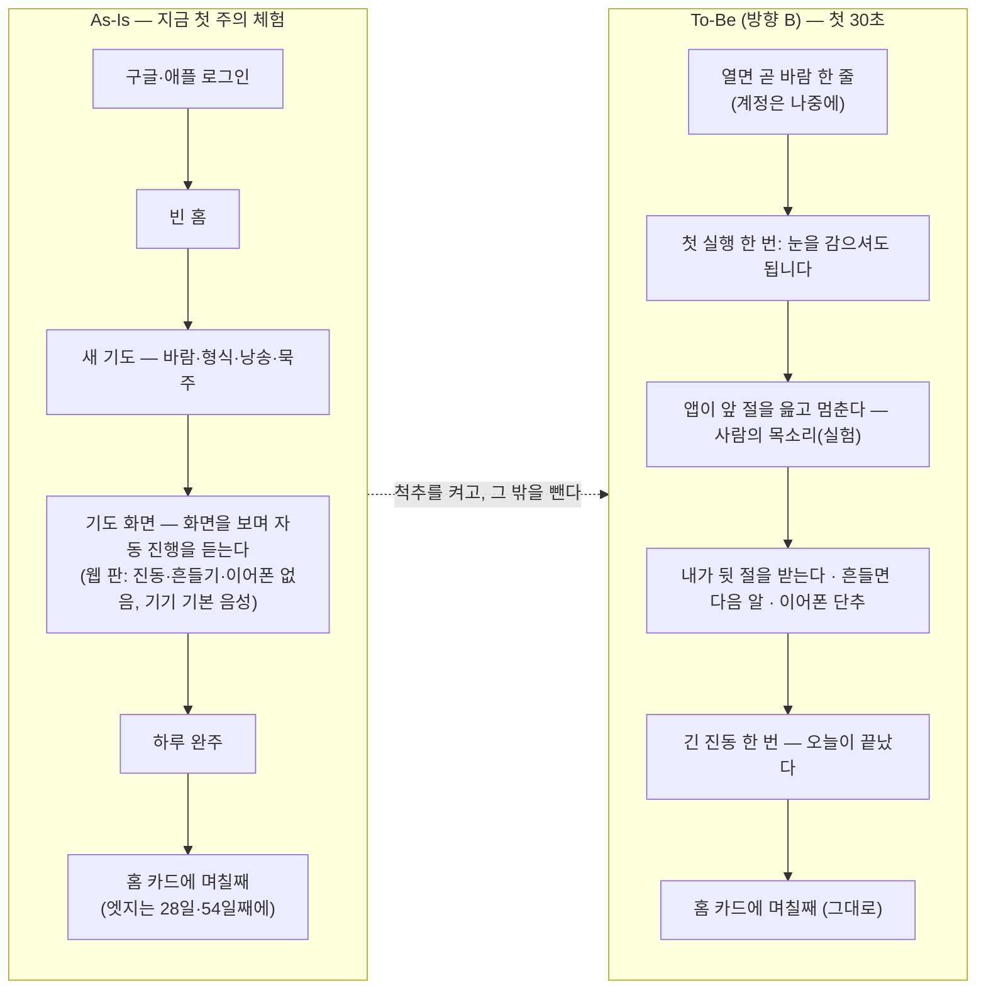

# 엣지 기획 — 한국 신자가 무료 앱 대신 이 앱을 고를 이유는 어디서 나오나

> 한 줄 요지: **이 앱의 엣지는 기능 여덟 개의 목록이 아니라 "화면을 보지 않고, 손을 쓰지 않고, 한국어 목소리와 함께 하루 다섯 단을 끝까지 바친다"는 한 가지 체험이어야 한다.** 그 체험은 05단계가 이미 중심 질문으로 못 박았고 코드에도 대부분 들어 있는데, 아직 한 번도 폰에서 증명되지 않았다 — 공방장이 며칠 써 본 판(웹 판)은 진동·흔들기·이어폰이 동작하지 않는 판이고, 첫 주의 화면은 전략에 따라 일부러 Marcello(공방장이 지금 쓰는 무료 앱)와 똑같이 만들었기 때문이다. 그래서 이 문서는 새 기능을 발명하지 않고, **척추를 하나로 좁히고 그 밖의 것을 빼는 방향**을 추천한다. 확정 전에 사람만 할 수 있는 일 둘이 먼저다 — 한국 경쟁 앱 둘의 화면을 실제로 보는 것, 그리고 설치본을 폰에 올려 척추를 한 번 겪는 것.

작성 2026-09-12 · KimPM · 요청 원문은 §1 끝에 있다. 이 문서는 결정을 내리지 않는다 — §7의 결정 카드에 공방장이 답하면 그 답을 `decisions.md`가 새 결정으로 적는다.

---

## 0. 결론 먼저 — 네 문장

1. **지금 엣지가 느껴지지 않는 것은 기능이 모자라서가 아니라, 엣지를 둔 자리가 첫 주에는 보이지 않는 자리이기 때문이다.** 문서가 "높다"고 판정한 차별점 셋(54일 진척, 낭송 셋, 전례색)은 각각 4주 뒤·기기 기본 음성·시기가 바뀔 때에야 드러나고, 공방장이 최근 가장 많이 본 것은 문서 자신이 "낮다 — 베끼기 쉽다"고 적은 묵주 고르기다.
2. **무료 앱을 이길 이유로 살아남은 것은 하나다 — 눈을 감고 끝까지 간다는 체험.** 비교한 세 앱은 물론 한국 앱 둘도(스토어 설명 기준, 화면은 미확인) 손 없이 바치기를 지원하지 않는다. 다만 이 체험의 질은 목소리에 달려 있고, 그 목소리는 아직 기기 기본 음성이다.
3. **그래서 추천은 더하기가 아니라 좁히기다.** 척추를 "눈 감고 끝까지"로 확정하고, 그 30초에 기여하지 않는 것 — 조 기도, 계정 필수, 판본 선택 화면, 묵주 그림 다듬기 — 을 V1에서 빼거나 멈춘다. 54일 진척은 만드는 값이 0이므로 그대로 남는다.
4. **이 추천이 뒤집는 기존 결정이 있고 그것을 숨기지 않는다.** 결정 4의 순서(웹 판으로 며칠), 공방장 정정 2·8·9(조 기도와 계정 필수), 05단계의 값 계단(창립 멤버 평생권)과 마켓 핏 지표(구매 20%)다. 뒤집을지는 §7의 카드로 공방장이 정한다.

---

## 1. 처음 읽는 분께 — 이 앱은 무엇이고 지금 어디까지 왔나

**MyRosary는 한국어 묵주기도 앱이다.** 묵주기도는 구슬(알)을 하나씩 넘기며 정해진 기도를 정해진 횟수 반복하는 가톨릭 기도이고, 한 번(다섯 단)을 바치는 데 스무 분쯤 걸린다. 한국 신자들은 이것을 하루 한 번의 기도로도 바치지만, 실제로 많이 하는 것은 **바람(지향) 하나를 정하고 54일 — 27일은 청원, 27일은 감사 — 을 날마다 채우는 일**이다. 이 앱은 그 54일을 끝까지 가게 하려고 만들어졌다. 묵주와 기도문 책이 없어도, 어두운 방에서 화면을 보지 않아도, 앱이 기도문 앞 절을 읽어 주고 사용자가 뒷 절을 받아 바치며(교대 낭송), 끊기면 그 자리부터 이어 준다. 상품기획은 atelier 저장소에서 여섯 단계를 거쳐 끝났고, 정본 문서(제품 요구사항 제3판 `docs/product/06-prd.md`, 요구사항 마흔둘)는 2026-09-05 이 저장소로 옮겨 왔다.

**지금은 구현 중이다.** 스택(Expo + React Native + Supabase)이 정해졌고(결정 3), 화면 열 중 여덟이 서 있으며(로그인·기도·하루 완주·홈·새 기도·여정 상세·여정 완주·설정), 여정과 설정이 기기에 저장된다. 2026-09-12 코드 대조(지휘 세션)에서는 요구사항 마흔둘 중 서른이 구현, 여섯이 일부, 여섯이 없음으로 나왔다 — 없는 여섯은 대부분 계정·서버·조 묶음(M3)이다. 서버는 "폰에서 먼저 써 본 뒤 붙인다"(결정 4)로 미뤄져 있고, 그 실사용을 위해 **파일 하나짜리 웹 판**을 만들어 폰 브라우저에서 열게 했다. 공방장이 그 앱을 며칠 써 본 뒤 이렇게 말했다.

> 실제로 동작하는 걸 보니깐, Edge있는 차별점이 없는데 이걸 어떻게 개선할지 기획안을 만들어줘 … 다른 방식의 기획이 필요해 그러면

두 번째 문장이 이 문서의 성격을 정한다. **있는 차별점 여덟을 다듬는 문서가 아니라, 우위가 어디서 나올 수 있는지를 처음부터 다시 묻는 문서다.** 질문은 하나다 — *한국 신자가 무료 앱 대신 이 앱을 고를 이유가 무엇인가, 그리고 그 이유는 어디서 나오나.* 답을 찾은 뒤에 기능이 따라오게 했고, 기능 목록에서 답을 찾지 않았다.

**어떻게 썼나.** 정본 문서(PRD·서비스 설계·결정 로그·개발 계획, atelier의 조사 01~05)를 읽고, 우위가 나올 자리를 기능 밖까지 열두 갈래로 벌린 뒤(§4), 갈래마다 세 질문 — Marcello가 무료로 이미 하지 않나, 한국 앱 둘을 보지 않고 세운 가정이 아닌가, 기도를 성과로 만드는 톤 규칙을 어기지 않나 — 으로 때려(§5), 살아남은 것을 세 방향으로 모았다(§6). 마지막에 공방장이 3분 안에 고를 수 있는 카드 한 장(§7)과, 어느 방향이든 먼저 해야 하는 사람 몫의 일(§8)을 두었다.

---

## 2. 진단 — 왜 지금 "엣지"로 느껴지지 않나

### 2-1. 공방장이 처음 원한 "Edge"가 무엇이었나 — 01단계 원문

이 프로젝트의 첫 문장(atelier `01-intake.md`, 2026-05-29)에 같은 단어가 이미 있다.

> 묵주기도 앱을 찾아봤는데 맘에 드는 게 별로 없더라고. 이게 내가 보던 기도문하고 다르기도 하고 그림도 … 어색하고 특히 앱들이 너무 투박하고 **Edge있게 만들어지지 않아서** 뭔가 불편해. 그나마 이게 제일 좋아서 쓰고는 있지.

공방장의 어휘에서 "Edge"는 기능의 수가 아니다. **만듦새가 날카롭고, 한 점이 선명한 것**이다. 기존 앱은 기능이 없어서가 아니라 투박해서 탈락했고, Marcello는 기능이 많아서가 아니라 단순해서 살아남았다. 그러니 오늘의 "Edge가 없다"도 "기능이 모자라다"로 읽으면 틀린다. **이 앱이 무엇으로 선명한지가 첫 주 안에 느껴지지 않는다**로 읽어야 한다.

### 2-2. 원인 하나 — 전략이 첫 주의 표면을 Marcello와 똑같이 만들었다

PRD §3-1의 전략 문장은 이렇다. *"기도 화면은 Marcello처럼 단순하게 지키고, 그 바깥에 여정과 계정과 조를 둔다."* 이 전략은 옳은 근거(03단계 반증 — Marcello의 1등 가치는 단순함)에서 나왔지만, 한 가지 결과를 구조적으로 낳는다. **사용자가 첫 주에 가장 오래 보는 화면(기도 화면)이 기준선 앱과 같아 보이도록 설계됐고, 다른 점(여정)은 며칠·몇 주가 지나야 드러나는 자리에 놓였다.** 며칠 써 본 사람이 "다른 게 없네"라고 느끼는 것은 전략의 실패가 아니라 **전략이 예고한 결과**다. 다만 전략은 "바깥에서 이긴다"고 했는데, 그 바깥의 절반(계정·조·기기 이동)은 아직 없다.

### 2-3. 원인 둘 — 척추(손 없이·소리)를 아직 한 번도 겪지 못했다

05단계가 이 사이클의 중심 질문(DQ-05)으로 못 박은 것은 *"화면을 보지 않고 손을 쓰지 않고도 5단을 끝까지 갈 수 있을까?"*였다. 그런데 공방장이 며칠 쓴 판은 결정 4가 만든 **웹 판**일 가능성이 높고(확인 필요 — §9), 결정 4 자신이 그 판에서 확인되지 않는 것 셋을 적어 두었다.

| 웹 판에서 동작하지 않는 것 | 왜 | 어느 차별점이 비어 있었나 |
|---|---|---|
| 아이폰의 진동 | iOS 사파리가 웹 페이지에 진동을 허용하지 않는다 | 읽지 않기 방식의 진행, 단 전환·완주 신호 |
| 이어폰 단추 | 앱이 "재생 중인 소리"를 잡아야 받을 수 있고 그것은 설치본의 일이다(결정 큐 Q-23 — 실기기에서도 아직 안 붙였다) | 손 없이 조작의 절반 |
| 흔들기 | iOS는 움직임 센서를 주기 전에 사용자에게 한 번 묻는데 그 절차가 웹 판에 없다 | 손 없이 조작의 나머지 절반 |

즉 공방장은 **"손 없이"가 빠진 상태의 앱**을 썼다. 남은 것은 화면을 보며 자동 진행을 듣는 것이었고, 그때 들린 목소리는 기기의 기본 한국어 음성(코드 `src/prayer/channels.ts`가 `expo-speech`로 부른다)이다. 척추가 없는 채로 겪었으니 엣지가 없다고 느낀 것은 정확한 관찰이다. 문제는 그 관찰이 "척추가 약하다"가 아니라 **"척추를 아직 켜 보지 못했다"**를 뜻한다는 점이다. 둘을 가르는 방법은 설치본 하나뿐이다(§8-2).

한 가지를 더 정직하게 적는다. **설치본에서 척추가 켜져도, 그 체험의 질은 목소리에 달려 있다.** 05단계는 교대 낭송의 자원을 "기도문 호흡을 살리는 음성 품질 — 많이 듦"으로 봤다가, "앱이 앞 절을 읽고 정해진 사이만큼 기다린다"는 구현으로 바꾸며 자원을 낮췄다(DQ-02). 그때 음성 품질의 질문은 사라진 것이 아니라 **미뤄진 것**이다. 기기 기본 음성이 기도문을 읽을 때 성스럽게 들리는지는 아무도 판정하지 않았다.

### 2-4. 원인 셋 — 최근 투자가 가장 베끼기 쉬운 자리에 갔다

2026-09-09부터 사흘 동안의 결정 여섯 개(결정 6·7·8·9·10과 결정 큐 Q-34~Q-43) 중 다섯이 **묵주 그림**에 관한 것이다 — 알 쉰아홉 다 그리기, 늘어진 모양, 재질 넷, 빛으로 진행 표시, 십자가 비율. 결정 7(기도 순서를 표준 도해에 맞춤)만 예외다. 이 작업들은 공방장의 요청에 정확히 응한 것이고 각각 근거가 있다. 다만 PRD §3-2가 묵주 고르기에 매긴 방어 가능성은 **"낮다 — 베끼기 쉽다"**이고, 사용자가 그것을 겪는 순간은 "설정에서 한 번"이다. 가장 잘 다듬어진 곳이 가장 덜 방어되는 곳이라는 사실은, 엣지가 어디에 있어야 하는지를 거꾸로 알려 준다.

### 2-5. 차별점 여덟의 현재 — 문서의 판정, 오늘의 구현, 공방장이 겪었나

| # | PRD 차별점 | 방어 가능성 (PRD §3-2) | 오늘의 구현 | 공방장이 며칠 안에 겪을 수 있었나 |
|---|---|---|---|---|
| 1 | 54일 기도의 진척 | **높다** | 있다 — 홈 카드·여정 상세·리본 | 며칠치만. 28일째 청원에서 감사로 바뀌는 순간과 54일째 완주는 **구조적으로 겪을 수 없다** |
| 2 | 낭송 방식 셋 | **높다** | 있다 — 기기 기본 음성 | 겪었다. 다만 목소리가 기기 기본 음성이라, 구조(교대)는 새롭되 소리는 투박하다 |
| 3 | 함께 바치기(조) | 중간 | 없다 (M3) | 못 겪었다 |
| 4 | 한국어로 손 없이 | 중간 | 자동 진행은 있다. 흔들기·이어폰은 웹 판에서 동작하지 않는다 | **핵심이 빠진 채** 겪었다 (§2-3) |
| 5 | 기도문 판본 선택 | 중간 | 판본이 **하나뿐**이다(D-4 미확정). 시트에는 하나만 보인다 | 고를 것이 없는 선택 화면을 봤다 |
| 6 | 묵주 고르기 | **낮다** | 있다 — 재질 넷, 미리보기, 빛 표시 | 겪었다. **가장 많이 다듬어진 곳** |
| 7 | 전례 시기 색 | **높다** | 있다 (Q-10·Q-18) | 9월은 연중 시기라 녹색 하나만 보인다. 바뀌는 것은 대림(11월 말)까지 볼 수 없다 |
| 8 | 끊겨도 이어짐, 기기 넘어서 | 중간 | 같은 기기 안에서는 있다. 기기 넘어서는 없다 (M3) | 같은 기기 안에서만 |

표를 한 줄로 읽으면 이렇다. **"높다" 셋은 첫 주에 보이지 않거나 투박한 목소리로 전달되고, 첫 주에 가장 잘 보이는 것은 "낮다" 하나다.** 여기에 판본 선택(고를 것이 없는 선택)과 조·기기 이동(없음)이 겹친다. 엣지가 없다는 느낌은 이 표에서 예측되는 느낌이다.

---

## 3. 우리가 모르는 것 — 한국 앱 둘을 보지 못했고, 그것이 1순위를 위협한다

**비교한 세 앱(Hallow 미국 · Marcello 이탈리아 · Rosario 프랑스)은 한국 사용자가 실제로 나란히 놓을 상대가 아닐 수 있다.** 한국 신자가 스토어에서 "묵주기도"를 검색하면 먼저 만나는 것은 굿뉴스 묵주기도(서울대교구 공식)와 성모님과 함께하는 묵주기도일 가능성이 높은데, 이 둘의 화면을 우리는 한 장도 보지 못했다. PRD §2-1이 그 사실을 이미 적어 두었고, §11-3은 *"한국 앱이 54일 기도를 어떻게 다루는지에 따라 차별점 1순위의 방어 가능성이 달라진다"*고 경고했다. 02단계 조사(`02-research.md`)가 스토어 설명에서 옮겨 적은 것을 PRD의 주장과 나란히 놓으면 이렇다. **오른쪽 칸은 전부 확인되지 않았다.**

| 축 | PRD가 세 앱에 대해 적은 것 | 한국 앱 둘의 스토어 설명 (02단계, **화면 미확인**) | 우리에게 뜻하는 것 |
|---|---|---|---|
| 54일·기간 기도 관리 | "세 앱 모두 없다" — 차별점 1순위의 근거 | 성모님과 함께: **기도 달력(9일×56일 관리)**, 9일 기도 기록, **청원/은혜 기록**, 지향별 알람. 굿뉴스: 지향 입력, **100일 관리**, 요일별 신비, 알람 | 한국 앱은 기간 기도 관리를 **이미 하고 있을 가능성**이 있다. 그렇다면 1순위의 "높다"는 세 외국 앱에 대해서만 참이다 |
| 손 없이 바치기 | Marcello·Rosario 안 됨, Hallow는 영어 | 둘 다 "hands-free 미지원" (02단계 판단) | 우리 4순위가 **한국 앱에 대해서도 비어 있는 유일한 자리**일 가능성이 높다 |
| 신비 묵상 | 세 앱 모두 배경·상징으로 처리 | 둘 다 **신비 묵상 음원**이 있다 | 우리에게는 신비 선포 한 줄뿐이다. 한국 앱이 우리보다 많이 갖는 자리 |
| 공식성 | 해당 없음 | 굿뉴스는 **서울대교구 공식** | 우리가 "공식"을 말할 수 없는 자리 |
| 값 | Marcello·Rosario 무료, Hallow 구독 | 둘 다 무료 | 한국 시장에서 값을 받는 앱은 우리뿐이 된다 |
| 만듦새 | Marcello 낡음, Hallow 무거움, Rosario 현대적 | "UX 투박"(리뷰). 굿뉴스는 글자를 키우면 행간이 따라 늘지 않는 결함이 리뷰로 확인됐다 | 01단계 원문의 "투박하고 Edge없다"가 가리킨 것이 이 둘일 가능성 |

이 표가 말하는 것은 둘이다. 첫째, **54일 진척을 제품의 정의로 밀려면 먼저 이 둘을 봐야 한다.** 그들이 이미 달력으로 관리하고 있다면 우리의 54일은 "더 잘 만든 같은 것"이 되고, 그것은 유료 앱이 무료 앱과 싸우기에 약한 자리다. 둘째, **손 없이 바치기는 한국 앱에 대해서도 비어 있을 가능성이 가장 높은 자리**다. 두 문장 모두 "가능성"이다. 확정은 촬영 뒤에만 가능하고, 그것은 사람만 할 수 있다(§8-1).

---

## 4. 우위가 나올 수 있는 자리 — 기능 밖까지 열두 갈래를 벌렸다

발산 단계에서는 평가하지 않고 벌렸다. 남기는 조건은 하나 — **"왜 이것이 무료 앱을 이기나"를 한 문장으로 답할 수 있는가.** 요청받은 일곱 갈래에 내가 찾은 다섯을 더했다(★ 표시).

| # | 갈래 | 한 문장으로 | 왜 무료 앱을 이기나 |
|---|---|---|---|
| 1 | 한 사람으로 좁힌다 — 퍼소나 A만 | 잠들기 전 이어폰을 끼고 두세 바람을 54일씩 바치는 30~50대 한 사람만을 위해 만든다 | 범용 무료 앱은 아무를 위해서도 만들어지지 않았다. 한 사람에게 꼭 맞는 도구는 대체되지 않는다 |
| 2 | 한 사람으로 좁힌다 — 퍼소나 B만 | 종이 기도문책을 놓지 못하는 60대 이상만을 위해 만든다 — 전부 읽어 주기, 큰 글씨, 조작 하나 | 굿뉴스가 시니어를 위한 글자 확대를 만들고 **실패했다**(행간). 실패한 자리는 비어 있는 자리다 |
| 3 | 54일을 제품의 정의로 | "묵주기도 앱"이 아니라 "54일 청원·감사 기도의 동반자"다. 앱을 열면 기도가 아니라 바람이 보인다 | 세 외국 앱에는 54일이 없다. 한국 신자의 관습을 아는 앱만 만들 수 있다 (단, §3의 위협) |
| 4 | 공동체와 배포 경로 | 스토어에서 혼자 내려받는 앱이 아니라 본당 신부님이 "우리 성당은 이걸 쓴다"고 권하는 앱. 조(FR-40)가 구역·반 모임과 이어진다 | 무료 앱은 스토어에서 각자 찾는다. 공동체가 채택한 도구는 개인의 값 비교를 거치지 않는다 |
| 5 | 공식성 | 기도문을 한국천주교주교회의(CBCK) 공인 판본으로 확보하고 그 사실을 앱이 말한다 | "내가 보던 기도문과 다르다"는 01단계의 첫 불만을 뿌리에서 없앤다 |
| 6 | 손 없이·눈 감고를 첫 30초의 체험으로 | 첫 실행에서 앱이 "눈을 감으셔도 됩니다"를 한 번 말하고, 앞 절을 읽고, 뒷 절을 기다리고, 흔들면 넘어간다. 그 30초가 이 앱의 자기소개다 | Marcello·Rosario는 알을 손으로 넘기고, Hallow는 영어이며, 한국 앱 둘은 손 없이를 지원하지 않는다(미확인). **셋 다 못 하는 유일한 자리** |
| 7 ★ | 목소리 | 기기 기본 음성이 아니라 **사람의 목소리**(사제 또는 성우)가 앞 절을 읊는다 | Hallow가 시장 1위인 이유의 절반이 목소리다. 한국어로 그것을 하는 앱은 없다. 6번의 질을 정하는 변수다 |
| 8 ★ | 바람의 결말 | 54일이 끝났을 때 "그 바람이 어찌 됐는지"를 한 줄 적어 두게 한다. 청원 기도의 관습에는 은혜를 기록하는 전통이 있다 | 기도를 세는 앱은 많고, 바람을 기억하는 앱은 적다 (단, 성모님과 함께에 "청원/은혜 기록"이 있다 — 미확인) |
| 9 | 값의 구조 | 1회 결제(창립 멤버 9~19달러)가 불리하다면 — 앱은 무료로 두고 목소리 팩에만 값을 붙이거나, 자율 후원이나, 본당 후원으로 받는다. 광고는 §9로 금지 | 값을 받는 자리를 사용자와 무료 앱 사이의 비교에서 **빼 버린다** |
| 10 | 빼기 | 여덟 중 무엇을 빼면 제품이 선명해지나 — 묵주 그림 투자 중단, 조 보류, 판본 선택 화면 숨김, 계정 필수를 선택으로, 9일·날마다 형식을 뒤로 | Marcello가 이기는 이유가 단순함이다. 우리가 로그인·마법사·조·설정 일곱 항목을 두는 동안 Marcello는 열면 기도다 |
| 11 ★ | 신비 묵상 콘텐츠 | 한국 앱 둘이 갖는 신비 묵상 글·음원을 우리도 갖는다 | 무료 앱을 이기는 것이 아니라 **따라잡는** 것이다 |
| 12 ★ | 물리 묵주·손목시계 연동 | 진짜 묵주나 워치의 진동으로 알을 세게 한다 | 바티칸 eRosary가 시도한 자리(디바이스 109달러). 우리 판돈·기간에 맞지 않는다 |

---

## 5. 적대 토론 — 세 질문으로 열두 갈래를 때렸다

요청받은 세 질문을 모든 갈래에 똑같이 물었다. 살아남지 못한 것은 부록 A에 이유와 함께 남겼다.

| # | 갈래 | Marcello가 무료로 이미 하는 것을 우리가 돈 받고 하는 것은 아닌가 | 한국 앱 둘을 보지 않고 세운 가정이 아닌가 | 톤 규칙(기도를 성과로 만들지 않는다)을 어기지 않나 | 판정 |
|---|---|---|---|---|---|
| 1 | 퍼소나 A만 | 아니다 — Marcello는 누구를 위해서도 좁히지 않았다 | 아니다 — 퍼소나는 01단계 인터뷰에서 나왔다 | 무관 | **살아남음.** 다만 좁히면 B(시니어)의 요구(전부 읽기·큰 글씨)가 기본값에서 뒤로 간다 |
| 2 | 퍼소나 B만 | 아니다 | **부분적으로 그렇다** — 굿뉴스의 행간 결함은 리뷰 한 줄이 근거다 | 무관 | 살아남되 **단독 척추로는 약함.** 03단계의 B는 본당에서 종이 기도문책으로 바치는 사람이라 앱으로 옮길 유인이 가장 약하고, 값을 낼 유인도 가장 약하다 |
| 3 | 54일을 정의로 | 아니다 — Marcello에 54일은 없다 | **그렇다. 가장 위험한 가정이다.** 성모님과 함께의 "기도 달력 9일×56일", 굿뉴스의 "100일 관리"가 스토어 설명에 있다 | 완주를 "위치"로만 말하면 어기지 않는다. 배지·백분율·공유는 §9가 이미 금지 | 살아남되 **촬영 전에는 확정할 수 없다.** 확정된다 해도 "관리"가 아니라 "동반"으로 재정의해야 한다 |
| 4 | 공동체·배포 | 아니다 | **그렇다** — 굿뉴스가 교구 공식이면 본당 신부가 먼저 권하는 앱은 그쪽일 수 있다 | 조 카드의 "누가 안 했나"를 앞세우지 않으면 어기지 않는다(06-c §4) | 살아남되 **V1의 척추로는 못 쓴다.** 엣지가 제품 안이 아니라 사람의 관계(영업·교구)에 있고, 그것은 이 저장소가 만들 수 없다 |
| 5 | 공식성 | 아니다 | 굿뉴스도 당연히 공인 판본을 쓸 것이다 — 우리가 그것을 갖는 것은 **우위가 아니라 동등**이다 | 무관 | **차별점에서 기본 요건으로 강등.** 다만 지금 앱은 사도신경·성모찬송이 첫 문장뿐이라(D-4·Q-39) 이것은 엣지가 아니라 **결함 제거**로 반드시 한다 |
| 6 | 첫 30초 체험 | 아니다 — Marcello는 알을 손으로 넘긴다. Hallow는 영어 | **가장 덜 그렇다** — 02단계가 한국 앱 둘을 "hands-free 미지원"으로 적었다(스토어 설명 기준, 미확인) | 06-d 화면 B는 "받아 바치세요 같은 지시문을 두지 않는다"고 했다. 첫 실행 **한 번만** 하는 안내는 지시문이 아니라 소개로 볼 수 있으나 **KimDesigner 검수 대상** | **살아남음 — 가장 강한 후보.** 단, 웹 판으로는 영원히 증명할 수 없다 |
| 7 | 목소리 | 아니다 — Marcello는 읽어 주지 않는다 | 한국 앱 둘의 "신비 묵상 음원"이 사람 목소리인지 모른다 | 무관 | **살아남음 — 6번의 질을 정한다.** 사제 목소리는 교회 승인·초상권이 앞에 있고(§9 V1.5), 성우·고품질 합성은 비용이 있다. 값은 모른다 |
| 8 | 바람의 결말 | 아니다 | **그렇다** — 성모님과 함께에 "청원/은혜 기록"이 있다 | **위험하다** — "응답됐나"를 묻는 순간 응답되지 않은 바람이 실패로 읽힌다. 묻지 않고 빈 줄 하나만 두면 지킬 수 있다 | 살아남되 **작은 것.** 방향 A에 딸린다 |
| 9 | 값의 구조 | **이 질문이 곧 이 갈래의 존재 이유다.** 값을 사용자와 무료 앱의 비교에서 빼는 유일한 길 | 한국 앱 전부 무료라는 사실은 02·03단계가 확인했다 | 후원 버튼이 "기도에 값을 붙인다"로 읽히지 않게 하는 것이 문구의 일 | **살아남음.** 세 방향 모두에 값의 답이 하나씩 붙는다 |
| 10 | 빼기 | Marcello가 이기는 이유 그 자체다 | 무관 | 무관 | **살아남음.** 다만 항목별로 무엇을 뒤집는지가 다르다 — §6에 나눠 적는다 |
| 11 | 신비 묵상 콘텐츠 | 아니다 | 한국 앱 둘이 이미 갖는다 — 우리는 뒤따르는 쪽 | 무관 | **버림(V1).** 콘텐츠 저작과 사제 검수가 앞에 있고, 이기는 자리가 아니다 |
| 12 | 물리 묵주·워치 | 아니다 | 무관 | 무관 | **버림.** 판돈·기간 밖 |

**세 질문이 드러낸 것.** 둘째 질문("한국 앱 둘을 보지 않고 세운 가정")에 가장 크게 걸린 것이 **54일**이고, 가장 덜 걸린 것이 **손 없이**다. 문서가 매긴 순위(54일 1순위, 손 없이 4순위)와 정확히 반대다. 그 순위는 세 외국 앱만 보고 매겨졌다.

---

## 6. 종합 — 살아남은 것이 세 방향으로 모인다

살아남은 갈래(1·3·6·7·9·10, 그리고 딸린 4·5·8)를 "제품을 한 문장으로 정의하면 무엇이 되나"로 묶으면 셋이 나온다. 각 방향에 **더하는 것보다 빼는 것을 먼저** 적었다.

### 6-1. 방향 A — "54일의 동반자"

**정의.** 묵주기도 앱이 아니라 *바람 하나를 54일 끝까지 함께 가는 앱*이다. 앱을 열면 기도가 아니라 내 바람과 며칠째가 보인다(이미 그렇다).

| | 내용 |
|---|---|
| 빼는 것 | 조 기도(FR-40)와 화면 G·I를 V1 밖으로. 묵주 그림 다듬기 중단(기능은 유지). 9일·날마다 형식은 남기되 앞세우지 않는다 |
| 더하는 것 | 첫날 의례(바람을 적으면 완료 예정일을 보이고 첫 성모송으로), **28일째 청원에서 감사로 넘어가는 조용한 한 화면**, 완주 화면에 바람의 결말을 적는 빈 줄 하나(묻지 않는다), 여정 상세를 홈 카드에서 한 번에 |
| 값 | 개인은 무료. 자율 후원 단추 하나 |
| 첫 30초에 겪는 것 | 바람을 적는 것. 기도 화면은 Marcello와 같다 — **엣지는 28일째와 54일째에 온다** |
| 뒤집는 결정 | 05단계 값 계단(창립 멤버 평생권)과 마켓 핏 지표(구매 20%). 공방장 정정 2·8(조 기도를 V1 기능으로)과 결정 1-1·1-3(화면 G·I) |
| 깨지는 지점 | **한국 앱 둘이 이미 달력으로 관리하고 있으면** "더 잘 만든 같은 것"이 된다. 그리고 엣지가 4주 뒤에 오므로 **첫 주의 이탈을 막지 못한다** — 공방장이 지금 느낀 것이 바로 그 첫 주다 |

### 6-2. 방향 B — "눈 감고 끝까지 가는 묵주"

**정의.** *화면을 보지 않고, 손을 쓰지 않고, 한국어 목소리와 함께 하루 다섯 단을 끝까지 바치게 하는 앱.* 05단계의 중심 질문(DQ-05)을 제품의 정의로 승격한 것이다. 54일 진척은 그대로 남는다 — 만드는 값이 0이고 이미 있다 — 다만 정의가 아니라 배경이 된다.

| | 내용 |
|---|---|
| 빼는 것 | 묵주 그림 다듬기 중단(기능 유지). 조 기도와 화면 G·I를 V1 밖으로. **판본 선택 시트를 판본이 하나일 때는 숨긴다**(고를 것 없는 선택은 거짓 선택지다). **계정을 필수에서 "나중에·선택"으로** — 로그인 없이 첫 기도로 들어가고, 기기를 옮기고 싶을 때 연결한다. 9일·날마다는 뒤로 |
| 더하는 것 | **설치본을 지금 만든다**(진동·흔들기·이어폰이 살아 있는 판). 이어폰 단추의 오디오 세션(Q-23)을 당긴다. 첫 실행 **한 번**의 소개 30초 — 앱이 "눈을 감으셔도 됩니다. 앞 절은 제가, 뒷 절은 함께"를 말하고 첫 성모송으로 들어간다(건너뛸 수 있다). **목소리 실험** — 기기 기본 음성, 고품질 합성 음성 1분 샘플, 사람 녹음 1분 샘플을 폰에서 공방장이 들어 판정한다 |
| 값 | 앱은 무료. 값은 **사람의 목소리 팩**에만 붙인다(04단계 수익-6 — "거부감이 가장 낮은 형태"). 목소리가 성립하지 않으면 자율 후원 |
| 첫 30초에 겪는 것 | **눈을 감고 첫 성모송의 뒷 절을 받는다.** 이것이 Marcello·Hallow·한국 앱 둘이 못 하는 것이다 |
| 뒤집는 결정 | **결정 4의 순서** — "웹 판으로 며칠 → 설치본"을 "설치본을 지금"으로(서버를 뒤로 두는 것은 그대로). **PRD §9 "목소리 고르기 V1.5"** → V1에서 실험. **결정 큐 Q-23**(이어폰 단추 미룸) → 당김. **공방장 정정 9(계정 필수)와 FR-32** → 선택 (큰 것). **정정 2·8(조)** → 보류. **05단계 값 계단·지표** |
| 깨지는 지점 | 기기 기본 음성이 기도에 맞지 않는데 사람 목소리의 승인·비용이 성립하지 않으면 척추가 투박한 채 남는다. iOS는 음량 버튼을 쓸 수 없다(§11-3 — 흔들기·이어폰만). **웹 판으로는 영원히 증명할 수 없어 계정 셋(Expo·Apple·Google) 승인이 선행 조건이다.** 계정을 선택으로 돌리면 기기 이동(8순위)이 뒤로 간다 |

### 6-3. 방향 C — "우리 성당의 묵주기도"

**정의.** 본당·구역·반 모임이 함께 쓰는 묵주기도 — *신부님이 권하는 앱.*

| | 내용 |
|---|---|
| 빼는 것 | 스토어에서 개인이 찾아 내려받는 것을 주 경로로 삼지 않는다 |
| 더하는 것 | 조(FR-40)를 지금 만든다(서버 지금). 본당 코드로 들어가는 길. 공인 기도문 판본 표기. 본당 단위 후원 |
| 값 | 개인 무료, **본당 후원 또는 라이선스**(05단계 V2 항목을 V1로) |
| 첫 30초에 겪는 것 | 성당에서 받은 코드를 넣는 것 |
| 뒤집는 결정 | **결정 4**(서버를 뒤로) → 지금. **PRD §9 "본당 라이선스 V1.5~V2"** → V1. 결정 3 스택은 그대로 |
| 깨지는 지점 | **굿뉴스가 서울대교구 공식이다** — 본당이 먼저 권할 앱이 그쪽일 수 있다. 엣지가 제품이 아니라 관계(영업·교구)에 있어 **이 저장소의 일이 아니다.** 바람 문구(아픈 사람 이름)가 조 안에서 돌며 개인정보 판돈이 오른다 |

### 6-4. 신선한 눈 — 토론을 잊고 카테고리째 빠진 축을 물었다

토론을 잊고 원래 질문과 세 방향만 놓고 "카테고리째 빠진 축은?"을 물었다. 셋이 나왔고, 결론을 바꾸는 것은 없었지만 카드에 반영했다.

- **사람의 유지비.** 세 방향 모두 만드는 값은 AI가 흡수하지만, 사람 몫이 다르다. A는 사제 자문 한 번, B는 **목소리의 승인·계약·비용**과 계정 셋, C는 **영업과 교구 관계**가 계속 든다. C가 가장 무겁고 A가 가장 가볍다. B는 목소리를 사람으로 가는 순간 무거워진다.
- **실패 뒤 복구.** A는 되돌리기 쉽다(문서와 값). B에서 계정을 선택으로 돌리는 것은 뒤에 다시 필수로 돌릴 수 있지만, **이미 계정 없이 쓰던 사람의 기기 데이터를 계정으로 옮기는 길**을 그때 만들어야 한다 — 값이 0은 아니다. C는 본당에 약속한 뒤 접으면 관계가 남는다.
- **검증의 기간.** 05단계가 "4주 — 줄일 수 없다"고 못 박은 검증 기간은 어느 방향이든 그대로다. 다만 A의 엣지(28일·54일)는 4주 안에 **한 번 겪기도 어렵고**, B의 엣지(30초)는 첫날 겪는다. 검증 설계에서 B가 유리하다.

---

## 7. 결정 카드

## 결정 요청 — 이 앱의 척추를 하나로 좁히고 그 밖의 것을 뺄 것인가, 그렇다면 어느 척추인가
- **트리거**: §2의 3번, 되돌리기 어려운 구조 선택 (제품의 정의와 V1 범위) · §2의 4번, 범위 초과 (기존 정정·결정을 뒤집는다)
- **무엇이 걸려 있나**: 지금 이대로 가면 M3(계정·서버·조)에 수 주가 들어가고, 그 뒤에도 첫 주의 체험은 Marcello와 같다 — 공방장이 이미 그 느낌을 확인했다. 방향을 좁히면 M3의 상당 부분이 뒤로 가고 그 시간이 척추(설치본·목소리·첫 30초)로 옮겨 간다. 잘못 고르면 두 가지 중 하나다 — 한국 앱 둘이 이미 하는 것(54일 관리)에 값을 붙이거나, 목소리에 돈과 승인을 쏟고도 기기 음성보다 낫다는 판정을 못 받는다. 되돌리기는 A가 가장 쉽고(문서·값), B는 계정을 뒤에 다시 필수로 돌릴 때 데이터 이관 길이 하나 필요하며, C는 본당과의 약속이 남는다.
- **결정 질문**: **"첫 주 안에 느껴지는 한 가지 체험을 위해, 이미 정한 기능(조 기도·계정 필수·1회 결제)을 V1에서 빼는 값을 치를 것인가?"**
- **옵션 비교**:

  | 옵션 | 비용 (돈·공수) | 시간 | 위험 | 되돌리기 |
  |---|---|---|---|---|
  | **A. 54일의 동반자** — 여정을 정의로, 조는 보류, 개인 무료 + 후원 | 돈 0. 공수 작음 — 28일째 화면 하나, 완주 빈 줄, 문서 개정 | 가장 짧음 — 대부분 이미 있다 | **한국 앱 둘이 이미 달력 관리를 하면 "더 잘 만든 같은 것"이 된다** (촬영 전 미확인). 엣지가 4주 뒤에 와 첫 주 이탈을 못 막는다 | 쉬움 |
  | **B. 눈 감고 끝까지** — 손 없이·목소리를 정의로, 조·계정 필수·판본 화면·묵주 다듬기를 뺀다, 앱 무료 + 목소리 팩 | 돈: 계정 셋(Apple 연 99달러 · Google 1회 25달러 — 어느 방향이든 든다) + **목소리 실험 비용(모름 — 샘플 1분 수준이면 작다)**. 공수 중간 — 설치본, 이어폰 오디오 세션, 첫 실행 30초, 계정 선택화 | 설치본은 계정 승인(며칠) 뒤 곧바로. 목소리 실험은 샘플만이면 1주 안 | 기기 음성이 기도에 맞지 않고 사람 목소리가 승인·비용에서 막히면 척추가 투박한 채 남는다. iOS 음량 버튼 불가. **웹 판으로는 증명 불가 — 계정 셋이 선행** | 보통 — 계정을 다시 필수로 돌릴 때 기기 데이터 이관 길 하나가 필요 |
  | **C. 우리 성당의 묵주기도** — 조·본당을 정의로, 서버 지금, 본당 후원 | 돈: 서버 비용 + 영업 시간. 공수 큼 — M3 전부 지금 | 가장 김 — 서버 뒤에 본당 관계가 든다 | **굿뉴스가 교구 공식**이라 본당이 먼저 권할 앱이 그쪽일 수 있다. 엣지가 제품 밖(관계)에 있어 이 저장소가 만들 수 없다. 개인정보 판돈 상승 | 어려움 — 본당과의 약속이 남는다 |

- **추천**: **B.** 사유 한 줄 — 셋 중 유일하게 (1) 비교한 세 앱과 한국 앱 둘(스토어 설명 기준)이 모두 하지 않고, (2) 첫 사용 30초 안에 겪으며, (3) 05단계가 이미 중심 질문으로 못 박았는데, 아직 한 번도 폰에서 켜 보지 못한 것이다. A의 54일 진척은 B 위에 값 0으로 그대로 남으므로 B를 고르면 A를 잃지 않는다. · **전문 검증**: 손 없이에 필요한 기기 기능(한국어 음성·진동·흔들기 센서·이어폰 리모트·화면 켜짐)은 결정 3의 스택 카드에서 공식 모듈이 있음을 확인했고, 자동 진행·흔들기·진동·음성 호출은 코드에 이미 있어 웹 e2e가 호출을 확인한다(`decisions.md` Q-21·Q-23). 없는 것은 **설치본**과 **이어폰의 오디오 세션** 둘이며, 둘 다 결정 3 카드가 예고한 작업이다.
- **무응답 시 기본 행동**: 방향을 확정하지 않는다. 대신 어느 방향에도 필요한 §8-1(한국 앱 둘 촬영)과 §8-2(설치본)를 진행하고, **묵주 그림·시트 다듬기 종류의 작업은 멈춘다.** M3 서버는 결정 4대로 대기한다. 촬영과 설치본 확인이 끝나면 이 카드를 그 결과와 함께 다시 올린다.
- **시각 자료**: 아래 As-Is/To-Be 도해. 옵션 비교는 위 표.

- **용어 각주**: **Marcello** — 공방장이 지금 쓰는 이탈리아 개발자의 무료 묵주기도 앱. 이 문서의 기준선이다. **웹 판** — 앱을 설치하지 않고 폰 브라우저에서 여는 임시 판(결정 4). 진동·흔들기·이어폰 단추가 동작하지 않는다. **설치본** — 앱스토어의 시험 배포(TestFlight·내부 테스트)로 폰에 설치하는 판. 계정 셋(Expo·Apple Developer·Google Play Console)이 있어야 만들 수 있다. **교대 낭송** — 앱이 기도문 앞 절을 읽고 사용자가 뒷 절을 받아 바치는 방식. **오디오 세션** — 앱이 "소리를 재생 중"이라고 기기에 알리는 상태로, 이어폰 단추 신호를 받으려면 필요하다. **CBCK** — 한국천주교주교회의. **톤 규칙** — 기도를 성과로 만들지 않는다는 문구·화면 규칙(디자인 시스템 §8).

### 상신 전 자가검사
1. 이 분야 지식 없이 3분 안에 답할 수 있는가 — 예. 질문은 "무엇을 빼는 값을 치를 것인가"다.
2. 경영 질문인가 — 예. 범위·시간·위험의 선택이다.
3. 풀이 없는 전문 용어 0개 — 각주에서 풀었다.

---

## 8. 어느 방향이든 지금 해야 하는 것 — 첫 번째 할 일은 사람만 할 수 있다

### 8-1. 한국 앱 둘을 실기기에서 촬영해 같은 표로 대조한다 — 첫 번째 할 일

이것이 없으면 §3의 "가능성"이 사실이 되지 않고, 방향 A의 생사와 방향 B의 "유일한 자리"가 둘 다 확정되지 않는다. 폰만 있으면 되고, 개발 도구가 필요 없다.

- **어디서**: 아이폰 App Store(또는 Android Play 스토어)에서 "굿뉴스 묵주기도"와 "성모님과 함께하는 묵주기도"를 각각 설치한다.
- **무엇을**: 각 앱에서 **다섯 장**을 찍는다 — 앱을 연 첫 화면, 기도 진행 화면(성모송 중), 54일·기간 기도를 만들거나 관리하는 화면, 지향(바람) 입력 화면, 설정 화면. 소리가 나면 사람 목소리인지 기계 음성인지 한 줄 메모.
- **성공하면 무엇이 보이나**: 사진 열 장이 이 저장소 `docs/plan/kr-competitors/`에 들어가고, PRD §2-3 표에 한국 앱 두 열이 "화면 미확인" 대신 실제 값으로 채워진다. 그 순간 §3의 표가 닫힌다.
- **안 하면 무엇이 걸리나**: 방향 A를 고르든 B를 고르든 "한국 앱 둘이 이미 한다"는 반론에 답할 수 없다. 02b 조사가 2026-08-30에 같은 부탁을 남겼고 아직 열려 있다.

### 8-2. 설치본을 폰에 올려 척추를 한 번 겪는다

공방장이 지금까지 겪은 것이 웹 판이라면, 이 앱의 척추(진동·흔들기·이어폰·눈 감고 끝까지)는 한 번도 켜진 적이 없다. 이 확인 없이는 "척추가 약하다"와 "척추를 못 켰다"를 가를 수 없다.

- **어디서·무엇을**: 계정 셋 등록 — 개발 계획 §9-1의 부탁 표에 화면 경로까지 적혀 있다(Apple Developer 연 99달러, Google Play Console 1회 25달러, Expo 무료). 등록되면 Claude가 설치본을 만들어 TestFlight로 보낸다.
- **성공하면 무엇이 보이나**: 폰에 앱 아이콘이 생기고, 잠자기 전 이어폰을 끼고 눈을 감은 채 다섯 단이 끝까지 가는지 — 한 줄 회신 "갔다 / 어디서 눈을 떴다".
- **안 하면 무엇이 걸리나**: 방향 B는 증명할 길이 없고, 결정 4가 정한 "실사용 뒤 서버"의 실사용도 사실상 시작되지 않은 것이 된다.

### 8-3. 방향 B를 택하면 함께 답해야 하는 것 — 답만 채우면 된다

각 항목에 권고를 달아 두었다. 답이 돌아오면 그대로 `decisions.md`에 새 결정으로 적고 진행한다. 권고와 다르게 답하면 그 행만 바뀐다.

| # | 질문 | 권고 (답이 없으면 이대로) | 무엇을 뒤집나 | 답 |
|---|---|---|---|---|
| B-1 | 조 기도(FR-40)와 화면 G(배정)·I(초대 코드)를 V1에서 뺄 것인가 | **뺀다 — V1.5로.** 조는 계정·서버를 요구하고 첫 30초와 무관하다. 코드와 화면은 지우지 않고 진입점만 닫는다 | 공방장 정정 2·8, 결정 1-1·1-3 | |
| B-2 | 계정을 필수에서 "나중에·선택"으로 돌릴 것인가 | **돌린다.** 로그인 없이 첫 기도로. 설정에 "다른 기기에서도 이어가기 — 계정 연결" 한 줄. 애플 심사의 계정 삭제 경로(5.1.1)는 계정을 연결한 사람에게만 필요하다 | 공방장 정정 9, FR-32, 개발 계획 M3 범위 | |
| B-3 | 판본 시트(S4)를 판본이 하나일 때 숨길 것인가 | **숨긴다.** 판본이 둘 이상 확보되면 자동으로 다시 보인다. FR-34(여정에 판본 고정)는 그대로 | 공방장 정정 3의 "기도문도 고를 수" 부분 — 판본이 하나인 동안만 | |
| B-4 | 묵주 그림 다듬기(결정 6~10 계열)를 멈출 것인가 | **멈춘다.** 기능(재질 넷·빛 표시)은 그대로 둔다. 다음 다듬기 요청은 방향 확정 뒤로 | 결정을 뒤집지 않는다 — 우선순위만 | |
| B-5 | 값 — 창립 멤버 평생권(9~19달러 1회)을 보류하고 "앱 무료 + 목소리 팩(사람 목소리에만 값)"으로 갈 것인가 | **간다.** 목소리가 성립하지 않으면 자율 후원. 마켓 핏 지표는 "구매 20%"에서 **"목소리 팩 구매 또는 후원 N%"로 재정의**가 필요하다 — N은 8-1·8-2 뒤에 정한다 | 05단계 값 계단, DQ-04 마켓 핏 지표 | |
| B-6 | 목소리 실험의 범위 | **셋을 폰에서 나란히 듣는다** — 지금의 기기 기본 음성 / 고품질 합성 음성 1분 샘플 / 사람(성우 또는 사제) 녹음 1분 샘플. 공방장이 잠자기 전 이어폰으로 듣고 "기도에 맞는가" 한 줄. 사제 목소리는 승인이 앞에 있으므로 **샘플 단계에서는 성우로** | PRD §9 "목소리 고르기 V1.5" → V1 실험 | |
| B-7 | 첫 실행 한 번의 소개 30초를 둘 것인가 | **둔다.** 건너뛸 수 있고 다시 나오지 않는다. 문구는 06-d의 "지시문 금지"와 충돌하지 않게 KimDesigner가 검수한다 | 06-d 화면 B 문구 규칙의 해석 | |
| B-8 | 이어폰 단추의 오디오 세션(Q-23)을 지금 붙일 것인가 | **붙인다.** 설치본과 함께. 손 없이의 절반이다 | 결정 큐 Q-23 | |

### 8-4. 지금 멈출 것

방향이 정해지기 전까지 **묵주 그림·시트·색 값을 다듬는 종류의 작업은 시작하지 않는다.** 그 작업들은 각각 옳았지만, 이 문서의 진단이 맞다면 그것은 엣지가 아닌 자리에 시간을 쓰는 일이다. M3(계정·서버·조)도 결정 4대로 기다린다 — B를 택하면 그 범위가 크게 줄고, C를 택하면 곧 시작한다.

---

## 9. 정직하게 남기는 것 — 모르는 것과 알아낼 방법

| 모르는 것 | 왜 중요한가 | 어떻게 알아내나 | 누가 |
|---|---|---|---|
| 한국 앱 둘의 실제 화면 — 54일·기간 관리를 어떻게 하는가, 손 없이가 정말 없는가, 소리는 사람 목소리인가 | 방향 A의 생사, 방향 B의 "유일한 자리" 확정 | §8-1 촬영 열 장 | **사람** |
| 공방장이 며칠 쓴 판이 웹 판인지 설치본인지 | §2-3의 진단 전체가 이 위에 있다 | 한 줄 질문 — "브라우저 주소로 여셨나, 앱 아이콘으로 여셨나" | 사람 |
| 기기 기본 한국어 음성이 기도문을 읊을 때 성스럽게 들리는가 | 방향 B의 척추의 질 | §8-2 설치본 + §8-3 B-6 실험 | 사람(판정) · Claude(샘플 준비) |
| 사람 목소리(성우·사제)의 비용과 승인 절차 | B-5 값 구조의 성립 여부 | 성우 1시간 녹음 견적 1건, 사제는 교구 문의 — 이 문서는 값을 지어 넣지 않았다 | 사람 |
| CBCK 공인 기도문의 사용 권한과 전문 확보 | 결함 제거(사도신경·성모찬송 첫 문장뿐) — 어느 방향이든 08 검증 전 필수(D-4·Q-39) | 주교회의 또는 교구 문의 | 사람 |
| 54일 기도에서 하루를 건너뛴 날의 신앙적 처리 | FR-35 기본값(강요하지 않음)의 정당성. 02단계 조사는 "하루는 이어서, 여러 날은 다시 시작 권장"을 적었다 | 사제 자문 한 번(PRD §11-3 이미 열림) | 사람 |
| 한국 신자가 값을 내는가 — 그리고 무엇에 | 05단계는 "구매 20%"로 잴 예정이었다. B-5로 값의 대상이 바뀌면 지표도 바뀐다 | 08 검증 4주. 지표 재정의는 방향 확정 뒤 | 사람(판정) · KimPM(지표 문안) |
| 계정을 선택으로 돌렸을 때 애플 심사(4.8 애플 로그인 의무, 5.1.1 계정 삭제)가 어떻게 바뀌나 | B-2의 비용 | 지침을 다시 읽는다 — 로그인을 강제하지 않으면 4.8은 "제3자 로그인을 두는 경우"에만 적용되고, 5.1.1은 계정을 만든 사람에게 삭제 경로가 있으면 된다. **이 읽기는 확인이 필요하다** | KimPM → 사람 확인 |
| 시장 규모·전환율 | 이 문서는 적지 않았다. 03단계에 추정치가 있으나 근거가 검색 추정이라 여기서 쓰지 않는다 | 08 검증 결과가 유일한 실측 | — |

---

## 부록 A. 발산에서 검토했다가 버린 안과 그 이유

| 버린 안 | 왜 버렸나 |
|---|---|
| 신비 묵상 콘텐츠(글·음원)를 V1에 넣는다 | 한국 앱 둘이 이미 갖는다(스토어 설명). 이기는 자리가 아니라 따라잡는 자리이고, 콘텐츠 저작과 사제 검수가 앞에 있다. V1.5 이후 기본 요건 후보로만 남긴다 |
| 물리 묵주·손목시계 연동 | 바티칸 eRosary(디바이스 109달러)가 시도한 자리. 판돈·기간·1인 팀에 맞지 않는다 |
| 공식성(공인 판본)을 차별점으로 세운다 | 굿뉴스도 당연히 공인 판본을 쓸 것이다. 우위가 아니라 동등이다. 다만 **결함 제거로는 반드시 한다** — 지금 사도신경·성모찬송이 첫 문장뿐이다 |
| 시니어(퍼소나 B)만을 위한 앱으로 좁힌다 | 굿뉴스의 행간 결함이 리뷰 한 줄뿐인 근거이고, 03단계의 B는 본당에서 종이 기도문책으로 바치는 사람이라 앱으로 옮길 유인과 값을 낼 유인이 가장 약하다. **B의 요구(전부 읽기·큰 글씨·조작 하나)는 어느 방향에서도 기본 요건으로 지킨다** |
| 공동체(본당)를 V1의 척추로 | 엣지가 제품이 아니라 관계에 있어 이 저장소가 만들 수 없고, 굿뉴스가 교구 공식이다. 방향 C로 남겨 두되 추천하지 않는다 |
| 바람의 결말(은혜 기록)에 "응답됐나"를 묻는다 | 응답되지 않은 바람이 실패로 읽힌다 — 톤 규칙 위반. 묻지 않는 빈 줄 하나로만 남긴다(방향 A) |
| 알림·푸시로 54일을 지킨다 | PRD §9가 "기도를 재촉하는 알림은 톤 규칙과 충돌 — 필요한지부터 08에서 검증"으로 미뤄 두었다. 이 문서는 그 판정을 건드리지 않는다 |
| 완주 공유 카드·연속 기록·순위 | §9가 "만들지 않는다"로 확정했다. 검토 대상에서 처음부터 제외 |
| 광고 | §9로 금지. 값의 구조 갈래에서 처음부터 제외 |
| 배속·건너뛰기로 기도 시간을 줄인다 | §9 — 기도는 탐색하는 것이 아니다. 결정 6·8이 단·알 이동을 넣었지만 배속은 여전히 밖이다 |

## 부록 B. 이 문서가 무엇을 보고 판단했나

이 저장소: `CLAUDE.md` · `docs/product/06-prd.md`(전문) · `docs/product/06-service-design.md`(전문) · `docs/product/06-design-system.md` §8 톤 · `docs/product/06-screen-spec.md` 화면 B·S4·S7 · `decisions.md`(전문 — 결정 0~10, 결정 큐 Q-01~Q-43, D-1~D-4) · `docs/plan/development-plan.md`(전문) · `docs/plan/rosary-lit/README.md` · `docs/lessons.md` · `spec/README.md` · `spec/journey-rules.md` · `spec/prayers.ko.json` · `.claude/retired.json` · 코드는 읽기만 했다 — `app/` 화면 목록, `app/settings.tsx`·`app/new.tsx`의 판본·결제 관련 주석, `src/prayer/channels.ts`의 음성 호출.

atelier 저장소 `idea/mobile-rosary/`: `01-intake.md`(원문 인용) · `02-research.md` §4 한국 앱·§5 가격·§12 54일 · `02b-design-research.md` §1-1 굿뉴스·§1-4 Rosario·§5 미확인 · `03-analysis.md` 경쟁 표·반증 점검·수익 모델 · `04-ideation.md` 수익 후보 여덟 · `05-prioritization.md` 2×2·값 계단·지표 두 줄.

이 문서가 쓴 숫자는 전부 위 문서에 있는 것이다 — 값(9~19·19~49·49~89·199~499달러, Hallow 9.99달러/월, 계정 비용 99·25달러), 지표(완주 50%·구매 20%), 화면 수, 요구사항 수(마흔둘, 서른·여섯·여섯은 2026-09-12 지휘 세션의 코드 대조), 스크린샷 수(36장). 시장 규모·전환율은 적지 않았다.
