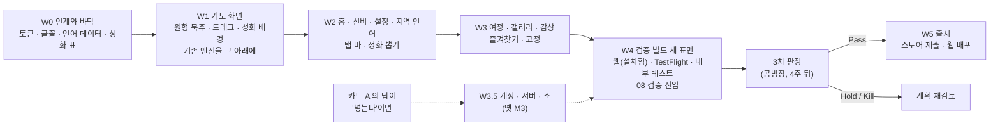

# MyRosary World 로드맵 — 인계 시안으로 최종 개발까지

> 한 줄 요지: **시안 「MyRosary World」가 화면과 조작의 새 정본이 되고(결정 11), 지금 있는 기도 엔진·여정 규칙·저장·시험은 그 아래에 그대로 남는다.** 길은 여섯 걸음이다 — 바닥을 새 어법으로 바꾸고(W0), 기도 화면을 다시 그리고(W1), 홈과 설정과 지역·언어를 세우고(W2), 여정과 성화 갤러리를 붙이고(W3), 스토어 앱과 웹 두 표면으로 검증 빌드를 내고(W4), 출시한다(W5). 시안이 침묵하는 여섯 가지(계정·조, 배포 형태, 언어 범위, 묵주, 낭송 척추, 판본·밤 벌)는 §3 의 카드 한 장으로 묻고, 답이 오기 전에는 거기 적힌 기본값으로 W0·W1 을 진행한다.

작성 2026-09-17 · 지휘 세션 · 요청 원문 — "이 시안으로 최종 개발을 하려고 하는데 로드맵을 잡아줘." 시안 원본은 [`docs/design/world/`](../design/world/README.md), 이 컨테이너에서 실제로 렌더한 화면 사진 열 장은 [`docs/plan/world-screens/`](./world-screens/README.md) 에 있다. 이 문서는 결정을 내리지 않는다 — §3 의 카드에 공방장이 답하면 그 답을 `decisions.md` 가 새 결정으로 적는다.

---

## 0. 결론 먼저 — 다섯 문장

1. **시안은 "새 앱"이 아니라 "새 껍데기"다.** 시안이 정한 것은 화면 열의 모양, 색과 글꼴, 원형 고리 묵주, 성화를 다루는 방식, 지역·언어의 구조다. 시안이 정하지 않은 것 — 하루 81단계, 54일 순환, 교대 낭송과 받는 사이, 진동, 손 없이 조작, 알마다 자리 저장 — 은 이 저장소에 이미 있고 시험까지 통과해 있다. 그래서 이 로드맵은 새로 만드는 일보다 **옮기고 잇는 일**이 많다.
2. **살아남는 것이 버리는 것보다 많다.** `spec/` 의 도메인 데이터, `src/prayer/` 의 진행기와 소리·진동 채널, `src/journey/` 의 여정 규칙, `src/storage/` 의 저장, e2e 시험 열한 벌과 그 하네스는 그대로 쓴다. 버리는 것은 화면 여덟의 겉모습과 물방울 고리 그림, 한지 토큰이다.
3. **시안이 침묵하는 여섯 가지는 사람이 정해야 한다.** 그중 가장 큰 것은 계정과 조 기도다 — 정본 요구사항은 필수(정정 2·8·9)인데 시안에는 없다. 이 문서의 추천은 **V1 에서 빼고 V1.5 로 미루는 것**이며, 그 이유와 대가는 §3 에 있다.
4. **순서는 기도 화면이 먼저다.** 시안 자신이 "가장 중요한 화면은 기도 진행 화면"이라 적었고, 이 앱의 척추(눈 감고 끝까지)도 거기 있다. 홈과 갤러리는 그 다음이다.
5. **첫 걸음은 이미 디뎠다.** 인계본을 저장소에 들여오고 실제로 렌더해 화면 열이 도는 것을 확인했다. 다음 한 걸음은 W0 — 새 디자인 토큰과 글꼴, 언어 일곱의 데이터를 `spec/` 과 `src/theme/` 에 앉히는 일이다.

---

## 1. 지금 서 있는 자리 — 무엇이 있고, 시안은 무엇을 바꾸나

### 1-1. 이 저장소에 지금 있는 것

2026-09-17 기준으로 요구사항 마흔둘 중 서른넷이 동작한다(구현 대조표 `implementation-audit.md` 의 서른에 그 뒤 붙인 FR-15·28·05 와 FR-38 조사가 더해졌다). 없는 여덟은 전부 계정·서버·조 묶음이다. 이것을 시안과 견주어 세 갈래로 가른다.

| 갈래 | 무엇 | 왜 그렇게 가르나 |
|---|---|---|
| **그대로 살아남는 것** | `spec/`(81단계 · 신비 · 54일 규칙 · 기도문) · `src/domain/` · `src/prayer/runner.ts`(진행기) · `channels.ts`(소리·진동) · `handsfree.ts`(흔들기·이어폰) · `phase.ts`(알의 다섯 상태) · `src/journey/`(여정 규칙 · 카드 · 세션) · `src/storage/`(여정 · 자리 · 설정) · `src/theme/fontScale.ts` · e2e 하네스와 시험 열한 벌 · 문서 PDF 도구 · 파일 하나짜리 웹 판 도구 | 시안은 이 층을 건드리지 않는다. 시안의 `buildSequence()` 가 만드는 81단계는 우리 `spec/prayer-sequence.json` 과 같은 순서다 — 두 쪽이 독립적으로 같은 답에 닿았다 |
| **시안의 어법으로 다시 그리는 것** | 화면 여덟(홈 · 새 기도 · 기도 · 하루 완주 · 여정 상세 · 여정 완주 · 설정 · 초대 코드)의 겉모습 · 묵주 그림(`rosaryState.ts` 의 물방울 고리와 `Rosary.tsx`) · 디자인 토큰(`tokens.ts` 의 한지 벌) · 바텀 시트 일곱 | 값이 바뀐다. 색·글꼴·간격·배치는 시안에서 다시 읽고, 물방울 고리는 원형 고리 + 늘어진 꼬리로 바뀐다(§3 카드 D) |
| **버리거나 접는 것** | 로그인 화면 · 초대 코드 입력 · 함께 바치기 배정(카드 A 의 답이 "미룬다"면) · 밤 벌(쪽빛) · 판본 선택 시트 S4 · 한지 토큰 | 시안에 자리가 없다. 코드는 지우지 않고 진입점만 끊어 두었다가, 되살릴 때 잇는다 |

### 1-2. 시안이 요구하는데 지금 없는 것

| 없는 것 | 시안의 어디에 있나 | 크기 |
|---|---|---|
| 원형 고리 묵주와 **손가락으로 고리를 돌려 알을 옮기는 조작** | Prayer 화면, `onDown` · `onMove` · `onUp` · `tapCenter` | 크다 — 묵주 그림을 새로 그린다 |
| 성화를 앱의 중심에 두는 장치 — 홈의 큰 그림, 열 때마다 다른 그림, 연속 반복 없음, 기도 중 고정, **고정하기**, **즐겨찾기** | Home · Complete · Art View · Gallery, `pickImage()` · `togglePin()` · `toggleFav()` | 중간 — 뽑기 규칙은 `src/art/session.ts` 가 절반 갖고 있다 |
| **성화 갤러리**(지역 · 전체 · 즐겨찾기)와 **전체 화면 감상** | Gallery · Art View | 중간 — 새 화면 둘 |
| **신비 해설**(네 벌, 성경 구절, 묵상 한 문단) | Mysteries Guide, `data.js` 의 `SCRIPTURE` · `MEDITATIONS` | 작다 — 새 화면 하나, 데이터는 시안에 있다 |
| **지역 다섯**(색 벌 · 성화 묶음 · 기본 언어)과 **언어 일곱**(기도문 · 신비 이름 · 화면 문구) | Region & Language, `REGIONS` · `LANGS` · `PRAYERS` · `MYSTERIES` · `UI` | 중간 — 데이터는 시안에 전부 있고, 이 저장소에는 언어 개념 자체가 없다 |
| **아래 탭 바 넷** | `navItems` | 작다 — 지금은 홈에서 갈라지는 구조 |
| **앱 안 글자 크기 넷**(작게 · 보통 · 크게 · 아주 크게) | Settings · Prayer 의 `Aa` | 작다 — 시스템 배율을 따르는 `fontScale.ts` 위에 한 단 더 얹는다 |
| **설치형 웹앱**(홈 화면에 추가 · 오프라인) | `manifest.webmanifest` · `sw.js` · Settings 의 설치 단추 | 중간 — Expo 웹 내보내기에 붙일 수 있다(§3 카드 B) |
| **움직임 줄이기** 토글과 스크린리더용 지금 알 안내 | Settings · `srText` | 작다 — 동작 줄이기는 이미 기기 설정을 따른다 |

### 1-3. 정본 요구사항은 요구하는데 시안이 침묵하는 것

시안을 만든 지시문(`prompt.md` §2)은 "보존할 기능" 목록을 주었고 시안은 그것을 지켰다. 그러나 그 목록에 **들어가지 않은** 요구사항이 있다. 시안이 틀린 것이 아니라 묻지 않은 것이다.

| 요구사항 | 시안의 처리 | 어떻게 하나 |
|---|---|---|
| 계정 필수 · 서버 저장 · 조 기도 · 초대 코드 (FR-32 · 40 · 41 · 44 · 45) | 없음 — 기기 저장(`localStorage`)만 | **카드 A** |
| 낭송 방식 셋(전부 · 교대 · 읽지 않기)과 받는 사이 (FR-06 · 11 · 12 · 13 · 07) | 음성 켬/끔 한 토글, 읽은 뒤 1.4초 고정 대기 | **카드 E** — 우리 엔진을 시안의 토글 자리에 잇는다 |
| 읽지 않기면 진동으로 진행 (FR-14), 알 넘어감 진동 | 알을 옮길 때 12ms 햅틱 하나 | 우리 진동 사전 그대로. 시안의 햅틱 토글이 그 켬/끔이 된다 |
| 손 없이 조작 — 흔들기 · 이어폰 단추 (FR-38) | 없음 | 그대로 둔다. 설정에 스위치 한 줄이 시안 어법으로 더해진다 |
| 알의 다섯 상태 (FR-15) | 지금 알의 빛무리 하나(숨쉬기 고정) | `phase.ts` 의 값을 시안의 빛무리에 잇는다 — 읽는 중 · 내 차례 · 멈춤이 갈려 보이게 |
| 54일 기도의 신비 순환 — 환희 → 고통 → 영광 (FR-43) | 요일 규칙 하나만 안다 | `spec/mysteries.json` 이 이긴다. 시안의 `DAY_TO_SET` 은 날마다 기도에만 쓴다 |
| 여정마다 자리와 진척을 따로 (FR-04), 기도가 여정에 속함 | 기도 세션이 하나이고, 완주하면 **모든** 여정에 그날 표시가 찍힌다 | 우리 `journey/session.ts` 가 이긴다. 홈의 여정 줄을 누르면 그 여정의 기도로 들어간다 |
| 묵주 고르기 — 서로 다른 셋 이상 (FR-39) | 금 알 하나(진주 선택지는 미리보기 속성으로만) | **카드 D** |
| 전례 시기 색 (FR-25) | 없음 — 지역마다 색 벌 하나 | 지역 색 벌의 강조색 한 슬롯을 전례색이 바꾸게 둔다. 시안의 겉모습을 깨지 않는 가장 작은 자리다 |
| 화면 켜짐 유지 (FR-20) · 완주 긴 진동 (FR-27) | 완주 진동은 있다(20·60·20). 켜짐 유지는 없다 | 그대로 둔다 |
| 기도문 판본 고정 (FR-34) · 판본 선택 시트 S4 | 없음 — 언어마다 기도문 한 벌 | **카드 F** |
| 밤 벌(쪽빛) | 없음 — 종이색 바탕에 기도 화면만 어두운 스크림 | **카드 F** — 결정 5(낮 고정)와 부합하므로 접는 쪽을 추천 |

---

## 2. 원칙 셋 — 두 정본이 어긋날 때 무엇이 이기나

이 로드맵 전체가 아래 셋 위에 서 있다. 구현자가 시안과 요구사항 사이에서 헤아릴 때 이 순서로 묻는다.

1. **화면과 조작은 시안이 이긴다(결정 11).** 색 · 글꼴 · 간격 · 배치 · 문구 · 조작의 모양 · 화면 사이의 이동은 `docs/design/world/` 에서 값 그대로 읽는다. v5 의 값은 더 쓰지 않는다. 이것은 v5 를 옮길 때 세운 원칙("옮기는 사람이 값을 새로 정하지 않는다")과 같다.
2. **기도의 규칙은 `spec/` 이 이긴다.** 81단계 순서 · 신비 순환 · 54일의 청원과 감사 · 받는 사이 공식 · 진동 사전 · 저장 규칙. 시안의 앱 논리가 이와 다르게 돌면(§1-3 의 순환·여정 두 줄) `spec/` 을 따르고, 그 사실을 결정 큐에 한 줄 남긴다.
3. **시안이 침묵하는 자리는 묻고, 답 전에는 기본값이다.** §3 의 카드가 그 자리 여섯이다. 답을 기다리는 동안 그 답에 **의존하지 않는** W0 와 W1 은 진행한다 — 기도 화면과 토큰은 계정이 있든 없든 같다.

---

## 3. 결정 카드 — 시안이 답하지 않는 여섯 가지

아래 여섯은 각각 정본 요구사항이나 앞선 결정을 뒤집거나 범위를 바꾸는 것이어서 사람 관문이다(에스컬레이션 §2 트리거 3 · 4). 조각조각 묻지 않고 한 장으로 올린다. **각 줄의 "추천"이 기본값이다.** 답이 없으면 그대로 진행하고, W3 에 들어가기 전까지 답이 없으면 기본값을 결정으로 확정해 `decisions.md` 에 적는다.

## 결정 요청 — 시안이 정하지 않은 여섯 자리를 어느 쪽으로 채우나

- **트리거**: §2 의 3번(되돌리기 어려운 구조 선택 — 계정·배포 형태) · 4번(범위 — 언어 일곱, 계정·조를 빼는 것)
- **무엇이 걸려 있나**: 시안은 "계정 없이, 기기 저장만으로, 설치형 웹앱으로, 지역 다섯·언어 일곱을 갖는 앱"을 그렸다. 정본 요구사항은 "계정 필수, 조 기도, 한국어만, 스토어 앱"이다. 둘을 그대로 합치면 화면은 시안대로인데 로그인이 먼저 막아서는 앱이 되고, 서버 비용과 애플의 로그인 심사(4.8 · 5.1.1)가 따라온다. 반대로 시안대로만 가면 정정 2·8·9(조 기도 · 계정 필수)를 뒤집는 것이고, 기기를 바꾸면 기록을 잃는다. 어느 쪽을 택하느냐에 따라 W4 이후의 크기가 절반쯤 달라진다.
- **결정 질문**: 시안이 그린 "가볍고 넓은 앱"(계정 없음 · 여러 언어)을 V1 로 낼 것인가, 아니면 정본이 그린 "깊고 좁은 앱"(계정 · 조 · 한국어)을 시안의 겉모습으로 낼 것인가. 아래 여섯 줄이 그 질문의 조각이다.
- **옵션 비교** (각 줄에서 하나를 고른다. 비워 두면 추천):

| # | 자리 | 추천 (기본값) | 다른 길 | 추천의 대가 · 위험 | 되돌리기 |
|---|---|---|---|---|---|
| **A** | **계정 · 서버 · 조 기도 · 초대 코드** (FR-32 · 40 · 41 · 44 · 45) | **V1 에서 뺀다 → V1.5.** 시안대로 기기 저장만. 정정 2·8·9 를 뒤집는다. 엣지 기획안(§6-2 방향 B)의 추천과 같은 방향이고, 애플의 "로그인 필수 앱" 심사 항목과 서버 비용이 사라진다 | V1 에 넣는다 — 시안에 로그인 화면을 시안 어법으로 더 그리고, W3 뒤에 계정·서버·조 마일스톤(M3 에 해당)을 끼운다 | 기기를 바꾸거나 앱을 지우면 기록을 잃는다(백업 파일 내보내기로 절반 보완 가능). 조 기도가 없다. 정정 2·8·9 를 뒤집는 것이라 공방장의 명시 답이 필요하다 | 보통 — 나중에 넣을 수 있게 저장 층을 계정 열쇠 없이도 도는 구조로 둔다 |
| **B** | **배포 형태** | **셋 다 — iOS · Android 스토어 앱 + 웹(설치형 웹앱).** 결정 3 의 Expo 한 코드로 세 표면을 낸다. 웹은 검증용으로 먼저 열고, 스토어는 W4 에서 | 웹만(시안 그대로) — 스토어 없음, EAS 빌드 없음 | 웹에서는 진동 · 흔들기 · 이어폰이 동작하지 않아(결정 4 가 실측) 척추가 웹에서는 절반이다. 그 사실을 웹 판 안에서 한 줄로 알린다 | 쉬움 — 표면을 하나 끄는 일 |
| **C** | **언어 범위 (V1)** | **한국어 · 영어 둘을 켜고 출시한다.** 나머지 다섯(이탈리아어 · 프랑스어 · 스페인어 · 포르투갈어 · 필리핀어)은 데이터를 들여오되 스위치 뒤에 두고, 원어 화자 또는 공식 기도서로 기도문을 확인한 언어부터 켠다 | 일곱 전부 켠다(시안 그대로) | 시안의 기도문 일곱 벌은 Claude Design 이 쓴 것이라 **출처가 확인되지 않았다.** 확인 없이 켜면 틀린 기도문을 바치게 할 수 있다 — 이 저장소의 규율(D-4 · Q-39)이 막는 바로 그 일이다 | 쉬움 — 언어 하나 켜기는 스위치 한 줄 |
| **D** | **묵주 그림** | **시안의 기하(원형 고리 + 늘어진 꼬리, 알은 고정되고 빛이 옮겨 감)를 채택한다 — 결정 8 의 물방울 고리를 뒤집는다.** 재질 넷(결정 9)은 유지해 시안의 금 알 자리에 붉은 장미 · 나무 · 은 · 금이 들어간다. 진행은 빛으로(결정 10 그대로) | 물방울 고리를 유지하고 시안의 나머지만 옮긴다 | 어두운 스크림 위에서 재질 넷의 대비(Q-43 의 3:1)를 다시 재야 한다. 2026-09-09~10 에 그린 늘어진 묵주와 사진 열두 장이 계보로 내려간다 | 보통 — 기하 모듈 하나를 바꾸는 일이고, 옛 모듈은 이력에 남는다 |
| **E** | **낭송 척추** | **시안의 "음성 · 자동 진행" 두 토글 자리에 우리 낭송 셋(전부 · 교대 · 읽지 않기)과 받는 사이(느리게 · 보통 · 빠르게), 손 없이 조작 스위치를 시안 어법으로 넣는다.** 시안의 1.4초 고정 대기는 쓰지 않는다 | 시안 그대로(전부 읽기 + 고정 대기) | 설정 화면이 시안보다 세 줄 길어진다. 대신 이 앱의 차별점(교대 낭송 · 눈 감고 끝까지)이 살아남는다 | 쉬움 |
| **F** | **판본 선택 시트 S4 · 밤 벌(쪽빛)** | **둘 다 접는다.** 시안에 자리가 없고, 밤 벌은 결정 5(낮 고정)와 시안의 어두운 기도 화면이 이미 그 몫을 한다. 판본은 언어마다 한 벌(D-4 로 확정) | 남긴다 | 판본 둘 이상을 원하는 사용자를 V1 에서 받지 못한다. 밤 벌 코드(Q-14 파생분)가 계보로 내려간다 | 쉬움 |

- **추천**: 여섯 줄 모두 "추천" 열. 한 문장으로 — **시안이 그린 가볍고 넓은 앱을 그대로 만들되, 이 저장소가 이미 가진 척추(교대 낭송 · 손 없이 · 54일 규칙)를 그 안에 잇고, 계정과 조는 다음 판으로 미룬다.** · **전문 검증**: 시안 인계본을 이 컨테이너에서 실제로 띄워 화면 열이 도는 것과 81단계 순서가 우리 `spec/` 과 같음을 확인했고(`world-screens/`), 시안의 앱 논리를 전문 읽어 §1-3 의 침묵 목록을 만들었다. Expo 한 코드로 스토어 앱과 웹을 함께 내는 것은 결정 3 카드에서 이미 검증한 전제다.
- **무응답 시 기본 행동**: 추천대로 W0 · W1 을 진행한다. W3 착수 전까지 답이 없으면 여섯 줄을 결정으로 확정해 `decisions.md` 에 적는다.
- **시각 자료**: 아래 §4 의 마일스톤 도해와 `world-screens/` 의 사진 열 장. 변화의 전후는 `docs/design/world/README.md` 끝의 "시안이 v5 와 다른 점" 표가 As-Is / To-Be 다.
- **용어 각주**: *설치형 웹앱(PWA)* — 브라우저에서 열되 홈 화면에 아이콘으로 놓고 인터넷 없이도 열리는 웹 페이지. *EAS 빌드* — Expo 가 운영하는 클라우드 빌드로, 맥 없이 iOS 앱을 만든다(결정 3). *스크림* — 글자가 읽히도록 그림 위에 얹는 어두운 반투명 층.

### 상신 전 자가검사

1. 이 분야 전문 지식이 없는 사람이 3분 안에 답할 수 있는가 — **예.** 여섯 줄 모두 "추천대로"가 답이 될 수 있고, 다른 길은 한 줄씩이다.
2. 결정 질문이 경영 질문인가 — **예.** 범위(계정 · 언어)와 비용(서버 · 심사)과 위험(틀린 기도문)의 질문이다.
3. 본문에 풀이 없는 전문 용어가 0개인가 — 각주에 셋을 풀었다.

---

## 4. 마일스톤 — W0 부터 W5 까지

각 마일스톤은 communication 규칙 7-3 에 따라 **무엇으로 닿았음을 증명하나**를 함께 적는다. 이 컨테이너에서 Claude 가 스스로 할 수 있는 검증은 웹 빌드의 Playwright e2e 와 화면 사진, 클라우드 빌드 성공 로그까지이고, **실기기 확인은 공방장 몫**이다.

| 마일스톤 | 만드는 것 | 노출 증명 (작업완료 조건) | 사람 몫 |
|---|---|---|---|
| **W0 인계와 바닥** | (끝난 것) 인계본을 `docs/design/world/` 로, 렌더 확인 사진 열 장, 결정 11. (할 것) ① 「Classical」 토큰과 지역 다섯의 색 벌을 `src/theme/tokens.ts` 에 새 벌로 앉힌다 — 한지 벌은 지우지 않고 계보로 표시. ② 글꼴 셋(Cormorant Garamond · Lora · Noto Serif KR)을 `assets/fonts/` 에 번들. ③ `data.js` 를 분해해 `spec/` 에 앉힌다 — 기도문 일곱 벌(`prayers.{언어}.json`, 출처 미확인 표시), 신비 이름 · 성경 구절 · 묵상 노트, 화면 문구 일곱 벌(`src/i18n/`). ④ 성화 열여섯 장과 초점 표를 `src/art/worldPlates.ts` 에 합친다(서명·워터마크가 보이는 넷은 표에 표시). ⑤ 언어와 지역을 설정에 넣고 문구 조회 함수를 만든다 | (1) 타입 검사와 단위 시험 통과, (2) 토큰 대비 시험이 지역 다섯 벌 전부에 대해 통과, (3) 웹 빌드가 서고 **실제 글꼴이 얹힌 화면 한 장**(이 컨테이너의 사진은 대체 글꼴이었다), (4) 언어를 바꾸면 문구가 바뀌는 단위 시험 | 없음 |
| **W1 기도 화면** | 시안의 Prayer 와 Complete 를 값 그대로. ① 원형 고리 묵주를 새로 그린다 — 고리 54 + 꼬리 5 + 메달 + 십자가, 알은 고정, 지금 알의 빛무리가 옮겨 간다. ② 고리를 손가락으로 돌려 알을 옮기고 가운데를 눌러 다음으로(시안의 `onDown` · `onMove` · `onUp` · `tapCenter`). ③ 성화 몰입 배경과 스크림 그라데이션, 머리(신비 · 단 · 25/81), 진행선. ④ **기존 엔진을 그 아래에 그대로 잇는다** — 81단계, 낭송 셋과 받는 사이(카드 E), 진동 사전, 알의 다섯 상태를 빛무리 값으로(FR-15), 흔들기 · 이어폰, 화면 켜짐 유지, 알마다 저장. ⑤ 글자 크기 넷(`Aa`)을 시스템 배율 위에 얹는다. ⑥ 완료 화면(성모송 수 · 분 · 여정 며칠째 · 이 성화 고정하기) | (1) `pray-loop` e2e 가 81단계를 완주(소리 · 진동은 호출 여부), (2) 고리 드래그로 알이 옮겨지는 e2e 새로 하나, (3) **320 · 375 · 390 · 430 네 너비**에서 묵주와 기도문이 겹치지 않는 사진 넷(시안 §8 의 요구), (4) 한국어 · 영어의 가장 긴 기도문(사도신경)이 잘리지 않는 e2e, (5) 공방장이 실기기에서 한 번 바치고 "고리를 돌리는 감각이 맞나 · 소리가 나나" 두 줄 회신, (6) "보는 법" 세 줄 | 실기기 1회 |
| **W2 홈 · 신비 · 설정 · 지역 언어** | 시안의 Home · Today's Mystery · Mysteries Guide · Settings · Region & Language 와 탭 바 넷. ① 홈 — 성화 큰 그림(열 때마다 다른 그림, 연속 반복 없음, 고정한 그림이 있으면 그것), 오늘의 신비와 첫 신비 한 줄, 주 단추, 진행 중 여정 목록. ② 신비 해설 네 벌. ③ 설정 — 지역·언어, 글자 크기 넷, 토글(낭송 셋 · 받는 사이 · 손 없이 · 햅틱 · 움직임 줄이기 — 카드 E), 묵주 고르기(카드 D), 완주 기록. ④ 지역 다섯 · 언어 일곱 화면(켜진 언어만 고를 수 있게, 카드 C). ⑤ 성화 뽑기를 `src/art/session.ts` 에 확장 — 지역 묶음 · 고정 · 기도 중 불변 | (1) 탭 바로 네 화면을 오가는 e2e, (2) 지역을 바꾸면 색 벌과 성화 묶음이 바뀌고 언어를 바꾸면 문구가 바뀌는 e2e(한국어 ↔ 영어), (3) 홈을 다시 열 때 그림이 바뀌되 기도 중에는 바뀌지 않는 e2e, (4) 화면 다섯의 사진, (5) KimDesigner 가 시안과 대조 검수 | 검수 회신 |
| **W3 여정 · 갤러리 · 감상** | 시안의 Journeys · Gallery · Art View. ① 여정 화면 — 목록(격자 18열 / 9열, 진척선, 삭제 확인), 새 여정(9일 · 54일 · 날마다, 지향 한 줄). **여정마다 자리와 54일 순환은 우리 규칙**(원칙 2). 홈의 여정 줄을 누르면 그 여정의 기도로. ② 갤러리 세 탭(지역 · 전체 · 즐겨찾기), 전체 화면 감상, 즐겨찾기, 고정(홈과 기도 배경에 반영) | (1) `journey` e2e — 새 여정에서 첫날 완주, 격자 갱신, 날짜를 돌려 54일째 여정 완주까지(청원 → 감사 28일째, 신비 순환), (2) 갤러리 · 즐겨찾기 · 고정 e2e, (3) KimQA `qa-swarm` 1회(웹 빌드), (4) KimDesigner 검수 | 검수 회신 · **카드의 답(늦어도 여기 전)** |
| **W3.5 계정 · 서버 · 조** (카드 A 의 답이 "넣는다"일 때만) | 옛 M3 그대로 — Supabase, 구글·애플 로그인, 스키마와 RLS, 동기화, 초대 코드 · 배정 함수. 로그인 · 초대 · 배정 세 화면을 **시안 어법으로 새로 그린다**(시안에 없으므로 KimDesigner 파생) | 옛 M3 의 증명 넷 + 마이그레이션 실환경 적용 꼬리표 | 라이브 DB 승인(열쇠) · OAuth 콘솔 |
| **W4 검증 빌드 세 표면** | ① 웹 — 설치형 웹앱(매니페스트 · 서비스 워커 · 오프라인 캐시 · "홈 화면에 추가")을 Expo 웹 내보내기에 붙이고 공개 주소 하나에 올린다. ② 스토어 — EAS 로 iOS(TestFlight) · Android(내부 테스트) 빌드. ③ 언어 — 한국어 · 영어를 켜고 나머지 다섯은 스위치 뒤(카드 C). ④ 08 검증 진입(참가자 10명 이내, 4주) — S7 소개 시트를 시안 어법으로 | (1) 웹 판이 폰 브라우저에서 설치되고 비행기 모드로 열리는 것을 공방장이 확인, (2) TestFlight 와 내부 테스트에 빌드가 오르고 참가자 폰에 설치, (3) 실기기에서 소리 · 진동 · 흔들기 · 이어폰 · 고리 드래그 다섯이 동작하는지 회신, (4) 4주 뒤 지표 두 줄 | Expo · Apple · Google 계정(옛 계획 §9-1), 참가자 모집, 실기기 회신, **기도문 판본 확인(한국어 사도신경 · 성모찬송 전문, 영어 기도문 — D-4)** |
| **3차 판정** | — | 완주 50% · 구매 의향 20%(DQ-04). 이 지표를 시안 방향에서도 그대로 쓸지는 판정 때 함께 본다 | **공방장 판정** Pass / Hold / Kill |
| **W5 출시** | 스토어 메타(아이콘 · 스크린샷 · 설명 · 개인정보 라벨), 개인정보 처리방침 주소, 심사 메모(음량 버튼 미사용, 카드 A 가 "미룬다"면 로그인 없음이라 4.8 · 5.1.1 해당 없음), 정식 성화 자산(D-1, 워터마크 한 장 교체), 웹 배포 주소 확정. 결제는 3차 판정 결과에 따라 | 심사 통과 뒤 **검색해서 설치되는 것**과 웹 주소가 열리는 것 확인 = 배포완료 | 심사 제출 승인, 성화 · 기도문 권리 |

**시안의 화면 열이 어느 마일스톤에 놓이나.** Prayer · Complete 는 W1, Home · Today's Mystery · Mysteries Guide · Settings · Region & Language 는 W2, Journeys · Gallery · Art View 는 W3 다. 합이 열이다. 시안에 없는 로그인 · 초대 · 배정 셋은 카드 A 의 답에 따라 W3.5 에 생기거나 생기지 않는다.

**일정 감각.** 만드는 노력은 AI 가 흡수하므로 병목은 사람 몫이다 — 카드의 답, 실기기 회신, 스토어 계정, 기도문 확인, 4주 실사용. W0 부터 W3 까지의 코드는 수 주 안이 현실적이며, 정확한 날짜는 W1 이 끝나 새 어법으로 화면 하나를 옮기는 데 실제로 얼마가 드는지 한 번 재고 나서 잡는다.

---

## 5. 시안 자체에서 고쳐 써야 하는 것 — 옮기는 사람이 미리 알아 둘 결함

시안은 완성도가 높지만 앱이 아니라 시안이다. 아래는 시안의 앱 논리를 전문 읽으며 찾은 것으로, 그대로 옮기면 안 되는 자리다. 각각을 어느 마일스톤이 고치는지 적었다.

| # | 시안이 이렇게 한다 | 왜 그대로 옮기면 안 되나 | 어디서 고치나 |
|---|---|---|---|
| 1 | 오늘의 신비를 **요일로만** 정한다(`DAY_TO_SET`) | 54일 기도는 환희 → 고통 → 영광 순환이다(FR-43). 시안대로면 54일 기도 중에 빛의 신비가 나온다 | W3 — `spec/mysteries.json` 의 규칙을 잇는다 |
| 2 | 기도 세션이 **하나**이고, 완주하면 **모든 여정**에 그날 표시가 찍힌다(`finish()`) | 여정마다 자리와 기록이 따로다(FR-04). 여정 둘을 가진 사람이 하루 한 번 바치면 둘 다 바친 것으로 잘못 기록된다 | W3 — 기도가 여정에 속하게 한다(지금 구조 그대로) |
| 3 | 음성을 켜면 **전부 읽고 1.4초** 뒤 넘어간다 | 교대 낭송과 받는 사이 공식(FR-11 · 13)이 이 앱의 차별점이다 | W1 — 카드 E |
| 4 | 한국어 사도신경 · 성모찬송의 **전문**이 들어 있고, 다른 언어 여섯의 기도문도 있다 | **출처가 확인되지 않았다.** 이 저장소는 기도문을 기억에 기대어 넣지 않는다(Q-39 · D-4). 겉으로는 공식 문구로 보이지만, 확인 전에는 "출처 미확인" 표시를 붙여 들여온다 | W0 들여오기, W4 전 사람 확인 |
| 5 | 십자가에 입맞춤의 문구가 "십자가에 입을 맞추십니다." | 우리 문구는 "십자가에 입맞춥니다."(Q-38). 둘 중 하나로 맞춘다 — 기본값은 우리 것 | W0 |
| 6 | **성화 넷에 작가 서명·스톡 워터마크가 있다** — `02-mary-child` · `04-cross` · `11-prayer-rosary` 은 같은 스튜디오의 워터마크, `13` 은 그림 안에 그려진 서명. 표에서 빠진 `09-color-jesus` 는 스톡 워터마크가 전면에 있다 | 시안 지시문 §3 자신이 워터마크 이미지를 금했다. 넷은 검증까지 두되 정식 자산에서 교체한다 | W5 전 (D-1 · Q-50) |
| 7 | 글꼴을 **Google Fonts 에서 받아 온다** | 앱은 인터넷 없이도 글꼴이 있어야 한다. 셋 모두 OFL 이라 번들할 수 있다 | W0 |
| 8 | 여정의 날짜 격자 열이 **18열**(54일) · 9열(9일) | 320px 너비에서 18열은 칸 하나가 12px 이 된다. 시안 §8 의 320px 요구와 맞는지 W3 에서 실제 너비로 재고, 안 맞으면 9열 여섯 줄로 | W3 |
| 9 | 지역을 바꾸면 그 지역 언어가 아닐 때 **언어까지 바꾼다**(`pick`) | 지시문 §5 는 "지역과 언어는 독립적으로 변경"이라 했다. 시안이 자기 지시문과 어긋난 자리다 — 언어는 사용자가 바꾸기 전까지 두는 쪽으로 | W2 |
| 10 | 진행 중인 기도를 홈의 "다시 바치기"가 **확인 없이** 처음으로 되돌린다 | 이 저장소는 자리를 지우는 조작에 확인 시트(S3)를 둔다(FR-18). 시안 어법의 확인 한 장을 파생한다 | W2 |

---

## 6. 사람 몫 — 순서대로

부탁 서식(communication 규칙 8-2)으로 적는다. 셋 다 브라우저나 폰만으로 되고, 기계가 대신할 수 없는 것이다.

| 순서 | 부탁 | 어디서 | 무엇을 | 성공하면 무엇이 보이나 | 안 하면 무엇이 걸리나 |
|---|---|---|---|---|---|
| 1 | **§3 카드에 답한다** | 이 문서(아티팩트) 또는 채팅 | 여섯 줄 중 추천과 다르게 갈 줄만 말한다. 전부 추천대로면 "추천대로" 한 마디 | `decisions.md` 에 결정 12 가 적힌다 | W3 착수. 답이 없으면 기본값으로 확정된다 |
| 2 | **스토어 계정 셋** | 브라우저 — developer.apple.com(연 $99) · play.google.com/console($25) · expo.dev(무료) | 옛 계획 §9-1 의 절차 그대로 | 각 콘솔에 계정이 보인다 | W4 의 스토어 빌드. Apple 승인에 하루 이상 걸리므로 **가장 먼저** |
| 3 | **기도문 확인** | 「가톨릭 기도서」(한국천주교주교회의) · 영어는 미국 주교회의(USCCB) 기도문 | 시안이 들여온 한국어 사도신경 · 성모찬송 전문과 영어 기도문 여덟이 공식 문구와 같은지 대조 | 다르면 그 줄만 알려 준다 | W4 검증 참가자가 실제로 바치는 기도문(D-4) |
| 4 | **실기기 확인** (W1 뒤, W4 뒤) | 공방장 폰(iOS) — TestFlight 또는 웹 판 | 하루 다섯 단을 바치며 고리 드래그 · 소리 · 진동 · 흔들기 · 이어폰 다섯을 본다 | 다섯 중 무엇이 되고 안 되는지 한 줄 | W1 · W4 의 작업완료 선언 |
| 5 | **성화 권리** (W5 전) | — | 열여섯 장의 출처와 사용 권한, 서명·워터마크가 있는 넷의 대체 | 권리 문서 한 장 | 정식 출시(D-1) |

---

## 7. 위험과 대비

| 위험 | 무엇이 걸리나 | 대비 |
|---|---|---|
| **고리 드래그가 실기기에서 손에 맞지 않는다** — 시안은 마우스와 브라우저 터치로만 검증됐다 | W1 의 핵심 조작 | 시안의 각도 계산을 그대로 옮기되, 알 사이 간격(360/56도)과 `moved` 문턱(3도)을 상수로 두어 실기기 회신 뒤 한 번에 조정한다 |
| **언어 일곱의 기도문이 틀렸을 수 있다** | 틀린 기도문을 바치게 하는 사고 | 카드 C — 확인한 언어만 켠다. 데이터에 `verified: false` 를 명시한다 |
| **어두운 스크림 위 재질 넷의 대비** | FR-39 · Q-43 | W1 에서 대비 시험을 스크림 색 다섯(지역마다 다르다)에 대해 돌린다 |
| **성화 위 글자의 가독성** — 시안은 그라데이션 마스크로 지키는데 그림마다 밝기가 다르다 | FR-24 · 시안 §7 금지 사항 | 열일곱 장 × 지역 색 벌에 대해 기도문 자리의 대비를 한 번 재는 시험을 W1 에 둔다 |
| **웹 설치형 앱과 Expo 웹 내보내기의 결합** — Expo 는 서비스 워커를 기본으로 주지 않는다 | 카드 B 의 웹 표면 | W4 에서 작은 서비스 워커 하나를 직접 쓴다(시안의 `sw.js` 가 본보기). 안 되면 웹은 "설치 없이 여는 판"으로 낸다 |
| **계정 없음(카드 A 추천)이면 기록 유실** | 기기 교체 · 재설치 | 설정에 "기록 내보내기 · 들여오기"(파일 하나)를 W3 에 작게 둔다. 서버 없이 되는 최소 보완이다 |
| **표면 셋 × 언어 둘 × 지역 다섯**으로 늘어난 검증 면 | 일정 | 지역은 색 벌과 그림 묶음만 다르므로 토큰 시험으로 덮고, e2e 는 한국어 · 영어 × 390 너비를 기준으로 돌린다 |
| **기존 e2e 열한 벌이 화면 구조 변경으로 한꺼번에 깨진다** | W1 · W2 | 하네스(`e2e/support/harness.ts`)와 진입 셀렉터를 먼저 새 화면에 맞추고, 시험은 마일스톤마다 그 화면 것만 되살린다 |

---

## 8. 지금 상태와 다음 한 걸음

- **끝난 것 (이 문서와 함께 커밋됨)**: 인계본 `docs/design/world/` 도입과 README, 실제 렌더 사진 열 장, 이 로드맵, 결정 11(`decisions.md`), CLAUDE.md 의 정본 표 갱신.
- **다음 한 걸음**: W0 — 토큰 · 글꼴 · 언어 데이터 · 성화 표. 카드의 답에 의존하지 않으므로 바로 시작할 수 있다. 착수 전에 KimDeveloper 에게 넘길 지시서를 `docs/plan/w0-work-order.md` 로 쓴다(옛 `m0-work-order.md` 와 같은 서식).
- **답을 기다리는 것**: §3 카드 여섯 줄.

## 9. 보는 법 — 시안 자체를 보려면

- **어디서**: 저장소의 `docs/design/world/` 를 웹 서버로 연다(README 의 "여는 법"). 사진만 보려면 `docs/plan/world-screens/`.
- **무엇을 하면**: 홈의 "오늘의 기도 시작"을 누르고, 묵주 고리를 손가락(마우스)으로 돌려 본다. 오른쪽 위 지구 단추로 지역을 바꿔 본다.
- **무엇이 보이나**: 원형 고리에서 빛이 알을 따라 옮겨 가고, 바친 알이 금빛으로 남는다. 지역을 바꾸면 종이색 · 강조색 · 성화 묶음이 함께 바뀐다.
